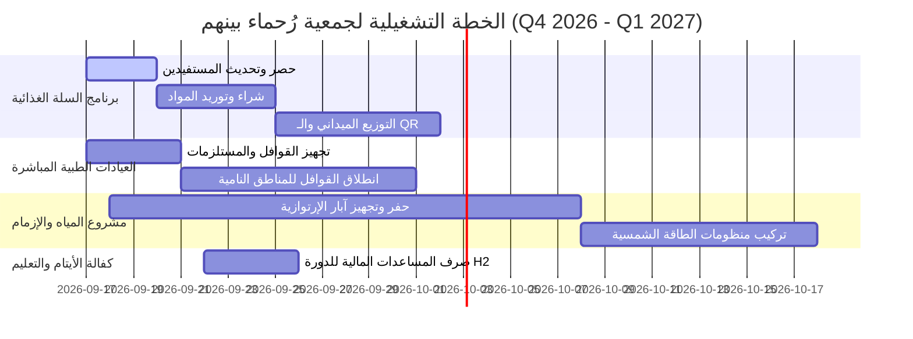

# الخطة التشغيلية الحقيقية والميدانية لجمعية رُحماء بينهم للعمل الإنساني والتنمية™
## UAMEX ERP™ Enterprise Operational Master Plan (2026-2027)
### تاريخ بدء التنفيذ الميداني: الخميس 17 سبتمبر 2026 (17-09-2026)

---

> [!IMPORTANT]
> **هوية المؤسسة والنظام:**
> - **المؤسسة:** جمعية رُحماء بينهم للعمل الإنساني والتنمية (Rohamā'a Baynahum Charity Foundation)
> - **النظام المؤسسي:** نظام يو امكس المؤسسي الشامل UAMEX ERP™ Intelligent Enterprise Operating System (الإصدار 3.9.0)
> - **الشعار والرمز الرسمي:** `LogoRohamaab.png` & `UAMEX_ERPLOGO.png`
> - **الشعار اللفظي:** One Platform. One Organization. One Vision. (منصة واحدة. مؤسسة واحدة. رؤية واحدة.)

---

## 1. الرؤية والاستراتيجية والهدف التشغيلي العام

تمكين جمعية رُحماء بينهم للعمل الإنساني والتنمية من إدارة كافة عملياتها الإغاثية والتنموية والمالية والإنتاجية من خلال نظام تشغيلي رقمي موحد (UAMEX ERP™)، يضمن أعلى مستويات الشفافية وفق المعايير الدولية للحوكمة (IPSAS & CHS & Sphere Standards)، ويوفر استجابة سريعة ومقيسة لاحتياجات المستفيدين ابتداءً من صباح يوم غدٍ الخميس 17 سبتمبر 2026.

---

## 2. مصفوفة مجالات المنظومة التشغيلية الـ 15 (UAMEX Enterprise Domains™)

| الرمز | اسم المجال التشغيلي | وصف النطاق التشغيلي والمخرجات الميدانية | المسؤول التنفيذي |
| :--- | :--- | :--- | :--- |
| **NEB-01** | Strategy & Performance OS | متابعة مؤشرات الأداء الاستراتيجي والتنبؤ بالأثر الإنساني | مدير التخطيط |
| **NEB-02** | Portfolio Management OS | إدارة المحفظة الإنسانية والتنموية وتوزيع الموارد على البرامج | مدير المحافظ |
| **NEB-03** | Program Management OS | تشغيل البرامج الرئيسية (السلة الغذائية، الإغاثة الطبية، كفالة الأيتام) | مدير البرامج |
| **NEB-04** | Project Management OS | إدارة المشاريع الميدانية ومخططات غانت وإدارة المخاطر | مدراء المشاريع |
| **NEB-05** | Operations OS (WBS) | متابعة الأنشطة الميدانية وهياكل تفكيك العمل في الميدان | مسئول العمليات الميدانية |
| **NEB-06** | Service Delivery OS | إدارة تسجيل وصرف مساعدات المستفيدين ببطاقات الـ QR والتحقق | مسؤول خدمات المستفيدين |
| **NEB-07** | Community & Membership OS | إدارة المتطوعين والفرسان الميدانيين وشبكات التواصل الميداني | مسؤول العمل التطوعي |
| **NEB-08** | Partnership & Funding OS | إدارة المانحين والشركاء الدوليين والتمويل المخصص والمنح | مدير العلاقات والشركاء |
| **NEB-09** | Resource & Asset OS | إدارة الأصول والمعدات والموارد البشرية والأداء الوظيفي | مدير الموارد والأصول |
| **NEB-10** | Finance & Compliance OS | القيود الدفترية، الصناديق المقيدة، وحسابات معايير (IPSAS 23/17) | المدير المالي |
| **NEB-11** | Knowledge & Document OS | الأرشفة الإلكترونية، السياسات، والتوقيع الرقمي المعتمد | مسؤول التوثيق والأرشيف |
| **NEB-12** | Integration & Digital Services OS | إرباط المخرجات عبر APIs وشبكة IATI الدولية وقواعد البيانات | مهندس الأنظمة والربط |
| **NEB-13** | AI Intelligence & Impact OS | الذكاء الاصطناعي التنبؤي وتحليل المخاطر وتقييم الأثر الميداني | أخصائي الذكاء والبيانات |
| **NEB-14** | Procurement & Tenders OS | إدارة طلبات الشراء، المناقصات، عروض الأسعار والموردين | مدير المشتريات |
| **NEB-15** | Sales, Revenue & Fundraising OS | استقبال التبرعات، كشوفات المساهمين، والتسويق الرقمي للفرص | مدير التمويل والتنمية |

---

## 3. المشاريع والبرامج الرئيسية المنفذة (جدول التنفيذ الميداني)



### تفاصيل البرامج الميدانية الحقيقية:
1. **مشروع السلة الغذائية الطارئة (Emergency Food Security):**
   - **المستهدف:** 5,000 أسرة في المناطق الأشد احتياجاً.
   - **آلية الصرف:** عبر بطاقات الـ QR Code الذكية المسجلة في وحدة المستفيدين (NEB-06).
   - **تاريخ البدء:** الخميس 17 سبتمبر 2026.

2. **برنامج القوافل الطبية والإغاثة السريعة (Medical Relief Caravans):**
   - **المستهدف:** تشغيل 3 قوافل طبية متنقلة مع تزويدها بأدوية ومستلزمات IPSAS المعتمدة.
   - **آلية الصرف:** الربط مع إدارة الأصول والأدوية في نظام المخازن (NEB-09/14).

3. **مشروع مياه الشرب النقية والطاقة الشمسية (Clean Water Infrastructure):**
   - **المستهدف:** إنشاء 4 محطات تحلية وتجهيز آبار بالطاقة الشمسية.
   - **إدارة المشروع:** متابعة مراحل التنفيذ والجداول الزمنية عبر محرك إدارة المشاريع (NEB-04).

---

## 4. الجدول الزمني التشغيلي اليومي (Daily Operating Schedule)
### يبدأ التطبيق العملي صباح غدٍ الخميس 17 سبتمبر 2026:

| الوقت | الإجراء التشغيلي | النظام والوحدة المستخدمة | المخرجات والمسؤول |
| :--- | :--- | :--- | :--- |
| **08:00 ص - 08:30 ص** | الإيجاز التشغيلي الصباحي ومراجعة التنبيهات | `ExecutiveQuantumCockpit.tsx` | مراجعة التنبيهات مع مدراء القطاعات |
| **08:30 ص - 10:30 ص** | اعتماد سندات الصرف وطلبات المشتريات المعلقة | `ApprovalWorkflowView.tsx` & `VoucherEntryTab.tsx` | المدير المالي ومدير المشتريات |
| **10:30 ص - 01:00 م** | التسجيل والتوزيع الميداني والتحقق من المستفيدين | `BeneficiariesView.tsx` (QR & PII Mask) | فرق التوزيع والمسح الميداني |
| **01:00 م - 02:30 م** | أرشفة العقود والمستندات والتوقيع الرقمي المعتمد | `DocumentationView.tsx` & `ElectronicSignatureModule.tsx` | مسؤول الأرشيف والشؤون القانونية |
| **02:30 م - 04:00 م** | مراجعة التقارير المالية والذكاء الاصطناعي وتقييم الأثر | `ReportsView.tsx` & `AIImpactDashboard.tsx` | مدير الذكاء والتخطيط الاستراتيجي |

---

## 5. ميزانية وتوزيع الصناديق المالية (IPSAS Fund Accounting)

```
                       ┌─────────────────────────────────────────┐
                       │  إجمالي الميزانية التشغيلية: $1,500,000  │
                       └────────────────────┬────────────────────┘
                                            │
        ┌───────────────────────────────────┼───────────────────────────────────┐
        ▼                                   ▼                                   ▼
┌───────────────┐                   ┌───────────────┐                   ┌───────────────┐
│ صناديق غير مقيدة │                   │  صناديق مقيدة  │                   │  صناديق دائمة  │
│  Unrestricted │                   │  Temporarily  │                   │  Permanently  │
│   $400,000    │                   │   $900,000    │                   │   $200,000    │
└───────────────┘                   └───────────────┘                   └───────────────┘
```

> [!NOTE]
> **قواعد الامتثال المالي (IPSAS 23 Compliance):**
> - يُمنع استخدام الصناديق المقيدة دائمة أو مؤقتة في غير الأغراض المحددة من المانحين.
> - يتم تقسيم القيود المحاسبية تلقائياً بواسطة محرك `DocumentSplittingEngine` لضمان عدم وجود عجز بين القطاعات.

---

## 6. خطة إدارة المخاطر وسد الفجوات التشغيلية

> [!WARNING]
> **المخاطر التشغيلية المحتملة والتصدي لها:**
> 1. **مخاطر انقطاع الاتصال في المناطق النائية:** تم تفعيل وحدة المزامنة المحلية وتطبيقات الخدمة الأوفلاين (PWA Service Worker Offline Sync).
> 2. **مخاطر تكرار صرف المساعدات:** تفعيل محرك `checkBeneficiaryDuplicates` والتحقق من الرقم الوطني الهوياتي.
> 3. **مخاطر تأخير المشتريات:** تفعيل محرك القوائم السوداء والبيضاء للموردين وحظر التوريد غير المطابق للمواصفات.

---

## 7. مؤشرات الأداء الحيوية (KPIs)

- **نسبة تغطية المستفيدين:** 100% من أسر الدرجة الأولى المستهدفة.
- **سرعة اعتماد السندات والموافقات:** أقل من 15 دقيقة عبر شاشات الموافقات الرقمية.
- **دقة البيانات المالية:** 0% انحراف محاسبي بين المدين والدائن مع الالتزام التام بمعايير IPSAS.
- **نسبة جاهزية النظام التشغيلي:** 99.9% uptime عبر خوادم Cloudflare WAF والشبكة الوطنية.
