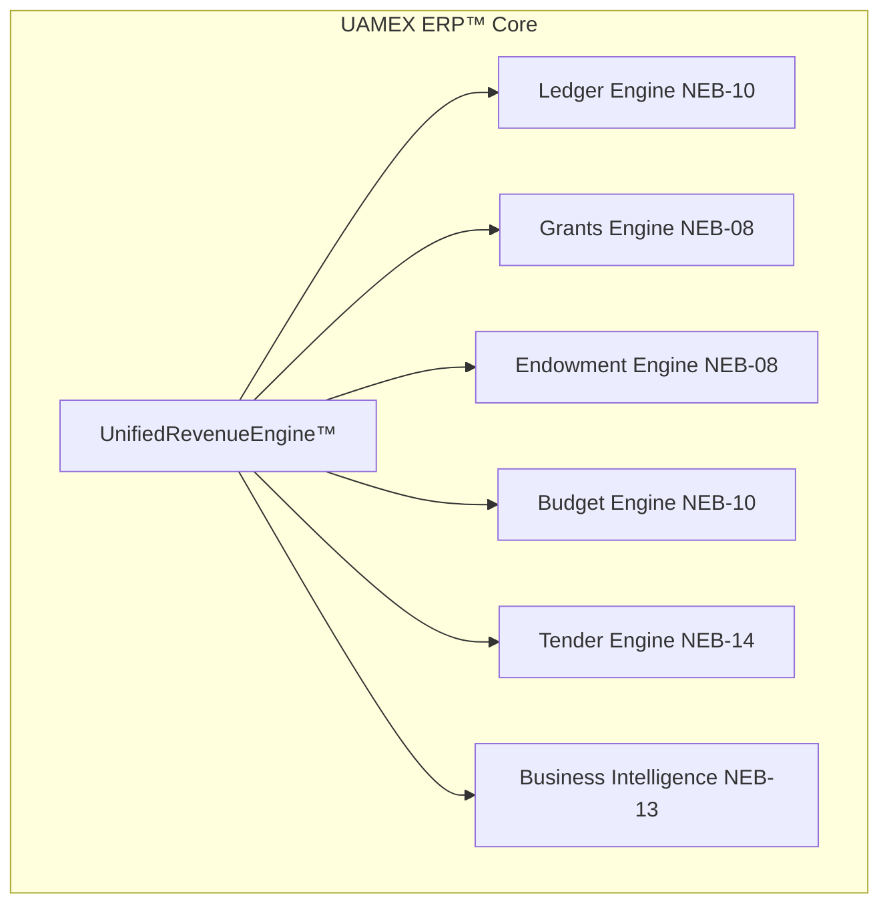

# UAMEX ERP™ NexoraOS — UnifiedRevenueEngine™ Architecture
## Domain: NEB-15 — Sales, Revenue & Fundraising OS

---

## 1. Executive Overview

### 1.1 System Purpose
The **UnifiedRevenueEngine™** is an enterprise-grade revenue management system designed to support all revenue types for charitable organizations, NGOs, development agencies, endowment foundations, and investment entities operating under IPSAS/Sphere/CHS standards.

### 1.2 Key Capabilities
- **Multi-Type Revenue Support**: 12 distinct revenue categories
- **Batch Processing**: Multi-account journal entries with automated validation
- **Enterprise Workflows**: Approval hierarchies, funding caps, dual-signature controls
- **Smart Intelligence**: AI-powered forecasting, anomaly detection, concentration analysis
- **Full IPSAS Compliance**: Revenue recognition, deferred revenue, fund accounting

### 1.3 Integration Points


---

## 2. Revenue Types Specification

### 2.1 Revenue Type Matrix

| Type Code | Arabic Name | English Name | Recognition Method | Exchange Type | Restricted? |
|-----------|-------------|--------------|-------------------|--------------|-------------|
| `CASH_DON` | تبرعات نقدية | Cash Donations | Cash Basis | Non-Exchange | Optional |
| `INKIND_DON` | تبرعات عينية | In-Kind Donations | Accrual | Non-Exchange | Optional |
| `GRANT` | منح ومخصصات | Grants & Allocations | Accrual/Deferral | Non-Exchange | Usually |
| `INVEST_REV` | إيرادات استثمارية | Investment Revenues | Accrual | Exchange | No |
| `ENDOW_REV` | إيرادات وقفية | Endowment Revenues | Accrual | Non-Exchange | Yes |
| `SERVICE_FEE` | رسوم خدمات | Service Fees | Accrual | Exchange | No |
| `MEMBERSHIP` | اشتراكات عضوية | Membership Fees | Accrual/Prepay | Exchange | No |
| `PROFIT_SHARE` | حصص أرباح | Profit Shares | Accrual | Exchange | No |
| `PROGRAM_REV` | إيرادات برامج | Program Revenues | Accrual | Mixed | Variable |
| `COND_FUND` | تمويل مشروط | Conditional Funding | Deferral | Non-Exchange | Yes |
| `PARTIAL_FUND` | تمويل جزئي | Partial Funding | Proportional | Non-Exchange | Yes |
| `MULTIYEAR_FUND` | تمويل متعدد السنوات | Multi-Year Funding | Straight-line | Non-Exchange | Yes |

### 2.2 Revenue Recognition Rules

```typescript
interface RevenueRecognitionRule {
  typeCode: RevenueTypeCode;
  method: 'CASH' | 'ACCRUAL' | 'DEFERRED' | 'PROPORTIONAL' | 'STRAIGHT_LINE';
  criteria: {
    whenEarned?: string; // condition for revenue recognition
    constraintDays?: number; // days to defer
    milestoneBased?: boolean;
    percentageComplete?: boolean;
  };
  ledgerPostingRules: {
    immediate: boolean;
    deferredAccountId?: string;
    restrictionCategory?: string;
  };
}
```

---

## 3. Data Models

### 3.1 Core Entities

```typescript
// ═══════════════════════════════════════════════════════════════════
// UAMEX ERP™ — UnifiedRevenueEngine™ Type Definitions
// Domain: NEB-15 Sales, Revenue & Fundraising OS
// ═══════════════════════════════════════════════════════════════════

export type RevenueTypeCode =
  | 'CASH_DON'
  | 'INKIND_DON'
  | 'GRANT'
  | 'INVEST_REV'
  | 'ENDOW_REV'
  | 'SERVICE_FEE'
  | 'MEMBERSHIP'
  | 'PROFIT_SHARE'
  | 'PROGRAM_REV'
  | 'COND_FUND'
  | 'PARTIAL_FUND'
  | 'MULTIYEAR_FUND';

export type RevenueStatus =
  | 'DRAFT'
  | 'PENDING_APPROVAL'
  | 'APPROVED'
  | 'POSTED'
  | 'PARTIALLY_COLLECTED'
  | 'COLLECTED'
  | 'REJECTED'
  | 'VOIDED'
  | 'EXPIRED'
  | 'CONDITIONALLY_COMPLETED';

export type RecognitionMethod = 'CASH' | 'ACCRUAL' | 'DEFERRED' | 'PROPORTIONAL' | 'STRAIGHT_LINE';
export type ExchangeType = 'EXCHANGE' | 'NON_EXCHANGE';
export type RestrictionLevel = 'UNRESTRICTED' | 'TEMPORARILY_RESTRICTED' | 'PERMANENTLY_RESTRICTED';
export type FundingScheduleType = 'ONE_TIME' | 'INSTALLMENT' | 'CONTINGENT' | 'MILESTONE_BASED';

// ─── Revenue Stream (Classification) ───────────────────────────────
export interface RevenueStream {
  id: string;
  organizationId: string;
  streamCode: string; // e.g., 'REV-CASH-001'
  nameAr: string;
  nameEn: string;
  revenueType: RevenueTypeCode;
  recognitionMethod: RecognitionMethod;
  exchangeType: ExchangeType;
  restrictionLevel: RestrictionLevel;
  defaultCurrency: string;
  defaultDebitAccountId: string;
  defaultCreditAccountId: string;
  deferredAccountId?: string; // for conditional/multiyear
  isActive: boolean;
  allowBatch: boolean;
  requiresApproval: boolean;
  minAmount?: number;
  maxAmount?: number;
  metadata: Record<string, any>;
  createdAt: string;
  updatedAt: string;
}

// ─── Single Revenue Record ─────────────────────────────────────────
export interface RevenueRecord {
  id: string;
  organizationId: string;
  revenueNumber: string; // e.g., 'REV-2026-00001'
  
  // Classification
  revenueType: RevenueTypeCode;
  streamId?: string;
  
  // Status & Workflow
  status: RevenueStatus;
  recognitionMethod: RecognitionMethod;
  restrictionLevel: RestrictionLevel;
  
  // Counterparty
  counterpartyType: 'INDIVIDUAL' | 'ORGANIZATION' | 'GOVERNMENT' | 'CORPORATE' | 'FOUNDATION' | 'UNKNOWN';
  counterpartyId?: string;
  counterpartyName: string;
  counterpartyCountry?: string;
  
  // Project & Activity
  projectId?: string;
  activityId?: string;
  costCenterId?: string;
  
  // Funding Details
  fundingScheduleType?: FundingScheduleType;
  fundingSourceId?: string;
  grantId?: string;
  endowmentId?: string;
  
  // Amounts
  amount: number;
  amountBase: number; // in org base currency
  collectedAmount: number;
  collectedAmountBase: number;
  currencyCode: string;
  exchangeRate: number;
  
  // Dates
  revenueDate: string;
  recognitionDate?: string;
  collectionDueDate?: string;
  actualCollectionDate?: string;
  
  // Deferred Revenue (for conditional/multi-year)
  deferredAmount?: number;
  recognizedAmount?: number;
  remainingDeferredAmount?: number;
  
  // References
  referenceNumber?: string;
  externalReference?: string;
  bankReference?: string;
  
  // Description & Attachments
  description?: string;
  attachments?: string[]; // file IDs
  
  // Conditional Funding
  conditionsMet?: boolean;
  conditionsDetails?: string;
  milestoneProgress?: number; // 0-100
  
  // Batch Reference (if part of batch)
  batchId?: string;
  batchSequence?: number;
  
  // Metadata
  metadata: {
    donorSegment?: string;
    campaignCode?: string;
    appealsCode?: string;
    giftAidEligible?: boolean;
    anonymousDonation?: boolean;
    recurringDonation?: boolean;
    recurringFrequency?: 'MONTHLY' | 'QUARTERLY' | 'ANNUAL';
    [key: string]: any;
  };
  
  // Audit
  createdById: string;
  approvedById?: string;
  postedById?: string;
  createdAt: string;
  updatedAt: string;
}

// ─── Batch Revenue (Multi-Entry Journal) ──────────────────────────
export interface RevenueBatch {
  id: string;
  organizationId: string;
  batchNumber: string; // e.g., 'BATCH-REV-2026-001'
  
  // Status
  status: 'DRAFT' | 'PENDING_APPROVAL' | 'APPROVED' | 'POSTED' | 'PARTIALLY_POSTED' | 'REJECTED' | 'VOIDED';
  
  // Summary
  totalDebit: number;
  totalCredit: number;
  isBalanced: boolean; // must always be true
  entryCount: number;
  
  // Control
  currencyCode: string;
  exchangeRate: number;
  batchDate: string;
  
  // Workflow
  approvalWorkflowId?: string;
  requiredApprovers: string[];
  currentApproverIndex: number;
  
  // Funding Caps
  appliesFundingCap: boolean;
  fundingCapId?: string;
  capRemaining?: number;
  
  // Description
  description?: string;
  
  // Audit
  createdById: string;
  approvedById?: string;
  postedById?: string;
  createdAt: string;
  updatedAt: string;
}

export interface RevenueBatchEntry {
  id: string;
  batchId: string;
  sequenceNumber: number;
  
  // Account Assignment
  accountId: string;
  accountCode: string;
  accountNameAr: string;
  
  // Amount
  debit: number;
  credit: number;
  currencyCode: string;
  exchangeRate: number;
  amountBase: number;
  
  // References
  projectId?: string;
  activityId?: string;
  costCenterId?: string;
  counterpartyId?: string;
  
  // Revenue Link
  revenueRecordId?: string;
  
  // Description
  lineDescription?: string;
  
  createdAt: string;
}

// ─── Funding Schedule (for Installment/Conditional) ────────────────
export interface RevenueSchedule {
  id: string;
  revenueRecordId: string;
  scheduleNumber: number;
  
  scheduledDate: string;
  scheduledAmount: number;
  scheduledAmountBase: number;
  currencyCode: string;
  
  // Actual
  actualDate?: string;
  actualAmount?: number;
  actualAmountBase?: number;
  
  // Status
  status: 'PENDING' | 'DUE' | 'PARTIALLY_PAID' | 'PAID' | 'OVERDUE' | 'CANCELLED';
  
  // Payment Reference
  paymentReference?: string;
  bankTransactionId?: string;
  
  // Conditions (for milestone-based)
  conditionDescription?: string;
  conditionMet?: boolean;
  conditionVerifiedById?: string;
  conditionVerifiedAt?: string;
  
  createdAt: string;
  updatedAt: string;
}

// ─── Funding Cap/Ceiling ───────────────────────────────────────────
export interface FundingCap {
  id: string;
  organizationId: string;
  capNumber: string;
  
  // Scope
  fundingSourceId?: string;
  donorId?: string;
  projectId?: string;
  activityId?: string;
  revenueType?: RevenueTypeCode;
  
  // Limits
  totalCapAmount: number;
  totalCapAmountBase: number;
  currencyCode: string;
  spentAmount: number;
  spentAmountBase: number;
  remainingAmount: number;
  remainingAmountBase: number;
  
  // Validity
  effectiveFrom: string;
  effectiveTo?: string;
  isActive: boolean;
  
  // Alerts
  alertThresholdPercent: number; // e.g., 80 = alert at 80% used
  
  createdAt: string;
  updatedAt: string;
}

// ─── Revenue Intelligence & Analytics ──────────────────────────────
export interface RevenueKPI {
  recordCount: number;
  totalRecognized: number;
  totalCollected: number;
  totalOutstanding: number;
  totalDeferred: number;
  collectionRatePct: number;
  recognitionRatePct: number;
  concentrationTop10Pct: number;
  averageTransactionSize: number;
  recurringRevenuePct: number;
}

export interface RevenueBreakdown {
  byType: Array<{
    revenueType: RevenueTypeCode;
    recordCount: number;
    totalAmount: number;
    totalCollected: number;
    percentageOfTotal: number;
  }>;
  byProject: Array<{
    projectId: string;
    projectCode: string;
    projectNameAr: string;
    totalAmount: number;
    totalCollected: number;
  }>;
  byCounterparty: Array<{
    counterpartyId: string;
    counterpartyName: string;
    totalAmount: number;
    percentageOfTotal: number;
  }>;
  byRestriction: Array<{
    restrictionLevel: RestrictionLevel;
    totalAmount: number;
  }>;
  byCurrency: Array<{
    currencyCode: string;
    totalAmount: number;
    exchangeRateAvg: number;
  }>;
}

export interface RevenueForecast {
  periods: Array<{
    period: string; // e.g., '2026-09'
    predicted: number;
    confidenceLow: number;
    confidenceHigh: number;
  }>;
  confidence: 'HIGH' | 'MEDIUM' | 'LOW';
  methodology: 'LINEAR_REGRESSION' | 'EXPONENTIAL_SMOOTHING' | 'SEASONAL';
  note?: string;
}

export interface RevenueAnomaly {
  id: string;
  type: 'CONCENTRATION' | 'DELAY' | 'AMOUNT_SPIKE' | 'COLLECTION_RATE' | 'UNUSUAL_PATTERN';
  severity: 'LOW' | 'MEDIUM' | 'HIGH' | 'CRITICAL';
  description: string;
  affectedRevenueIds: string[];
  detectedAt: string;
  acknowledged: boolean;
  acknowledgedById?: string;
  acknowledgedAt?: string;
  resolution?: string;
}

export interface IntelligenceSnapshot {
  kpis: RevenueKPI;
  breakdowns: RevenueBreakdown;
  forecast: RevenueForecast;
  anomalies: RevenueAnomaly[];
  insights: string[]; // AI-generated insights
  generatedAt: string;
}

// ─── Revenue Report Configuration ─────────────────────────────────
export interface RevenueReportConfig {
  id: string;
  nameAr: string;
  nameEn: string;
  type: 'DETAILED' | 'SUMMARY' | 'ANALYTICAL' | 'EVALUATIVE' | 'BI_DASHBOARD';
  
  // Filters
  dateRange: { from: string; to: string };
  revenueTypes?: RevenueTypeCode[];
  projectIds?: string[];
  counterpartyIds?: string[];
  statusFilter?: RevenueStatus[];
  currencyCodes?: string[];
  
  // Grouping
  groupBy?: 'TYPE' | 'PROJECT' | 'COUNTERPARTY' | 'CURRENCY' | 'RESTRICTION' | 'MONTH';
  
  // Columns
  includeColumns: string[];
  
  // Totals
  showTotals: boolean;
  showSubtotals: boolean;
  
  // Export
  format: 'TABLE' | 'PIVOT' | 'CHART' | 'CSV' | 'EXCEL' | 'PDF';
  
  isScheduled: boolean;
  scheduleCron?: string;
  recipients?: string[];
}
```

---

## 4. API Endpoints

### 4.1 RESTful API Structure

```typescript
// ═══════════════════════════════════════════════════════════════════
// UAMEX ERP™ — UnifiedRevenueEngine™ API Routes
// Base Path: /api/v2/revenue
// ═══════════════════════════════════════════════════════════════════

// ─── Revenue Streams ───────────────────────────────────────────────
// GET    /streams              - List all streams
// GET    /streams/:id         - Get stream by ID
// POST   /streams             - Create new stream
// PUT    /streams/:id         - Update stream
// DELETE /streams/:id         - Deactivate stream
// GET    /streams/:id/usage   - Get usage statistics

// ─── Revenue Records ───────────────────────────────────────────────
// GET    /records                    - List records (paginated)
// GET    /records/:id               - Get record with details
// POST   /records                   - Create single record
// PUT    /records/:id               - Update record
// DELETE /records/:id               - Void record

// Workflow Actions:
// POST   /records/:id/submit        - Submit for approval
// POST   /records/:id/approve       - Approve record
// POST   /records/:id/reject        - Reject record (with reason)
// POST   /records/:id/post          - Post to ledger (IPSAS)
// POST   /records/:id/collect       - Record collection
// POST   /records/:id/partial-collect - Partial collection
// POST   /records/:id/recognize     - Recognize deferred revenue
// POST   /records/:id/void          - Void with reason

// ─── Batch Revenue ─────────────────────────────────────────────────
// GET    /batches                   - List batches
// GET    /batches/:id              - Get batch with entries
// POST   /batches                  - Create batch
// POST   /batches/:id/validate     - Validate batch balance
// POST   /batches/:id/submit       - Submit batch for approval
// POST   /batches/:id/approve      - Approve batch
// POST   /batches/:id/post         - Post all entries to ledger
// POST   /batches/:id/void         - Void entire batch

// ─── Revenue Schedules ─────────────────────────────────────────────
// GET    /schedules                 - List schedules
// GET    /schedules/:id             - Get schedule details
// POST   /schedules                 - Create schedule
// PUT    /schedules/:id             - Update schedule
// POST   /schedules/:id/verify-condition - Verify milestone/condition
// POST   /schedules/:id/process-payment  - Process scheduled payment

// ─── Funding Caps ──────────────────────────────────────────────────
// GET    /caps                      - List funding caps
// GET    /caps/:id                 - Get cap details
// POST   /caps                     - Create funding cap
// PUT    /caps/:id                 - Update cap
// POST   /caps/:id/check           - Check if amount within cap
// GET    /caps/:id/utilization     - Get utilization report

// ─── Intelligence & Analytics ──────────────────────────────────────
// GET    /intelligence/snapshot    - Get full intelligence snapshot
// GET    /intelligence/kpis        - Get KPIs only
// GET    /intelligence/breakdowns  - Get breakdowns
// GET    /intelligence/forecast    - Get revenue forecast
// GET    /intelligence/anomalies   - Get detected anomalies
// POST   /intelligence/anomalies/:id/acknowledge - Acknowledge anomaly

// ─── Reports ───────────────────────────────────────────────────────
// GET    /reports/detailed          - Detailed revenue report
// GET    /reports/summary          - Summary report
// GET    /reports/analytical       - Analytical report
// GET    /reports/evaluative       - Evaluative report
// GET    /reports/bi               - BI dashboard data
// POST   /reports/generate         - Generate custom report
// GET    /reports/export           - Export report

// ─── Integration Endpoints ─────────────────────────────────────────
// POST   /integration/ledger/link          - Link to ledger entry
// POST   /integration/grants/link         - Link to grant
// POST   /integration/endowment/link      - Link to endowment
// POST   /integration/budget/link         - Link to budget line
// GET    /integration/sync-status        - Check sync status
```

### 4.2 API Request/Response Examples

```typescript
// POST /api/v2/revenue/records
// Create a new grant revenue with schedule

interface CreateRevenueRequest {
  streamId?: string;
  revenueType: RevenueTypeCode;
  counterpartyName: string;
  counterpartyType: string;
  projectId?: string;
  activityId?: string;
  amount: number;
  currencyCode: string;
  exchangeRate?: number;
  revenueDate: string;
  recognitionMethod?: RecognitionMethod;
  restrictionLevel?: RestrictionLevel;
  description?: string;
  referenceNumber?: string;
  
  // For grants/funding
  fundingScheduleType?: FundingScheduleType;
  grantId?: string;
  conditionsDetails?: string;
  
  // Metadata
  metadata?: {
    donorSegment?: string;
    campaignCode?: string;
    giftAidEligible?: boolean;
  };
}

interface CreateRevenueResponse {
  success: boolean;
  data: {
    id: string;
    revenueNumber: string;
    status: RevenueStatus;
    amount: number;
    recognitionMethod: RecognitionMethod;
  };
  warnings?: string[];
}

// POST /api/v2/revenue/batches
// Create batch with multiple entries

interface CreateBatchRequest {
  batchDate: string;
  currencyCode: string;
  exchangeRate?: number;
  description?: string;
  entries: Array<{
    accountId: string;
    debit?: number;
    credit?: number;
    projectId?: string;
    activityId?: string;
    counterpartyId?: string;
    description?: string;
    // Optional: link to revenue record
    revenueRecordId?: string;
  }>;
  applyFundingCap?: boolean;
  fundingCapId?: string;
}

interface CreateBatchResponse {
  success: boolean;
  data: {
    id: string;
    batchNumber: string;
    status: string;
    isBalanced: boolean;
    totalDebit: number;
    totalCredit: number;
    entryCount: number;
  };
  validationErrors?: Array<{
    entryIndex: number;
    field: string;
    message: string;
  }>;
}

// POST /api/v2/revenue/batches/:id/post
// Post batch to ledger with automatic journal entry creation

interface PostBatchRequest {
  postDate: string;
  fiscalYearId: string;
  journalDescription?: string;
  generateSubEntries?: boolean; // split multi-account entries
}

interface PostBatchResponse {
  success: boolean;
  data: {
    batchId: string;
    postedEntries: number;
    journalEntryId: string;
    journalEntryNumber: string;
    postedAt: string;
    ledgerEntries: Array<{
      accountCode: string;
      debit: number;
      credit: number;
      projectId?: string;
    }>;
  };
  warnings?: string[];
}
```

---

## 5. User Interface Components

### 5.1 Component Architecture

```tsx
// ═══════════════════════════════════════════════════════════════════
// UAMEX ERP™ — UnifiedRevenueEngine™ UI Components
// Domain: NEB-15 Sales, Revenue & Fundraising OS
// ═══════════════════════════════════════════════════════════════════

// Main Container Component
export interface UnifiedRevenueEngineProps {
  lang: 'ar' | 'en';
  userPermissions: UserPermission[];
  organizationId: string;
}

// Sub-Components Structure
export const RevenueEngineComponents = {
  // ─── Main Tabs ───────────────────────────────────────────────────
  'RevenueDashboard': RevenueDashboard,
  'RevenueRecords': RevenueRecordsGrid,
  'BatchRevenue': BatchRevenueManager,
  'RevenueSchedules': ScheduleManager,
  'FundingCaps': FundingCapsManager,
  'RevenueReports': ReportsCenter,
  'IntelligenceCenter': IntelligenceCenter,
  
  // ─── Record Management ────────────────────────────────────────────
  'RevenueForm': RevenueRecordForm,
  'RevenueDetail': RevenueDetailPanel,
  'CollectionWizard': CollectionWizard,
  'RecognitionWizard': RecognitionWizard,
  'ApprovalWorkflow': ApprovalWorkflowPanel,
  
  // ─── Batch Processing ─────────────────────────────────────────────
  'BatchBuilder': BatchEntryBuilder,
  'BatchValidator': BatchBalanceValidator,
  'BatchApprovalChain': ApprovalChainVisualizer,
  
  // ─── Schedule Management ─────────────────────────────────────────
  'ScheduleTimeline': ScheduleTimeline,
  'MilestoneChecker': MilestoneConditionChecker,
  'InstallmentTracker': InstallmentProgressTracker,
  
  // ─── Reports & Analytics ─────────────────────────────────────────
  'KPICardDeck': RevenueKPIDeck,
  'BreakdownCharts': BreakdownVisualizations,
  'ForecastChart': RevenueForecastChart,
  'AnomalyAlertPanel': AnomalyAlertList,
  
  // ─── Integration Panels ────────────────────────────────────────────
  'LedgerIntegrationPanel': LedgerLinkManager,
  'GrantIntegrationPanel': GrantLinkManager,
  'EndowmentIntegrationPanel': EndowmentLinkManager,
};
```

### 5.2 Dashboard Layout

```tsx
// RevenueDashboard Component Structure
const RevenueDashboard: React.FC<RevenueDashboardProps> = ({ lang, orgId }) => {
  return (
    <div className="space-y-6">
      {/* Header */}
      <RevenueEngineHeader 
        title={lang === 'ar' ? 'محرك الإيرادات الموحد — NEB-15' : 'Unified Revenue Engine — NEB-15'}
        subtitle={lang === 'ar' 
          ? 'إدارة شاملة لكل أنواع الإيرادات — تبرعات، منح، استثمارات، أوقاف'
          : 'Comprehensive revenue management — donations, grants, investments, endowments'
        }
      />
      
      {/* Navigation Tabs */}
      <RevenueNavigationTabs 
        tabs={[
          { id: 'dashboard', labelAr: 'لوحة التحكم', labelEn: 'Dashboard', icon: LayoutDashboard },
          { id: 'records', labelAr: 'سجلات الإيرادات', labelEn: 'Revenue Records', icon: FileText },
          { id: 'batch', labelAr: 'التوريد الجماعي', labelEn: 'Batch Revenue', icon: Layers },
          { id: 'schedules', labelAr: 'الجدولة', labelEn: 'Schedules', icon: Calendar },
          { id: 'caps', labelAr: 'أسقف التمويل', labelEn: 'Funding Caps', icon: Shield },
          { id: 'reports', labelAr: 'التقارير', labelEn: 'Reports', icon: BarChart3 },
          { id: 'intelligence', labelAr: 'مركز الذكاء', labelEn: 'Intelligence', icon: Brain },
        ]}
      />
      
      {/* Tab Content */}
      <Switch activeTab={activeTab}>
        <Case value="dashboard">
          <DashboardContent />
        </Case>
        <Case value="records">
          <RevenueRecordsContent />
        </Case>
        {/* ... other tabs */}
      </Switch>
    </div>
  );
};
```

### 5.3 KPI Dashboard Component

```tsx
// KPI Cards Deck Component
const RevenueKPIDeck: React.FC<RevenueKPIDeckProps> = ({ kpis, lang }) => {
  const isAr = lang === 'ar';
  
  const cards = [
    {
      key: 'totalRecognized',
      label: isAr ? 'إجمالي الإيرادات المعترف بها' : 'Total Recognized',
      value: fmt(kpis.totalRecognized),
      icon: TrendingUp,
      color: 'emerald',
      trend: '+12.5%',
      trendUp: true,
    },
    {
      key: 'totalCollected',
      label: isAr ? 'المحصّل الإجمالي' : 'Total Collected',
      value: fmt(kpis.totalCollected),
      icon: Banknote,
      color: 'sky',
      trend: '+8.2%',
      trendUp: true,
    },
    {
      key: 'totalOutstanding',
      label: isAr ? 'المستحق المتبقي' : 'Outstanding',
      value: fmt(kpis.totalOutstanding),
      icon: Clock,
      color: 'amber',
      trend: '-3.1%',
      trendUp: false,
    },
    {
      key: 'collectionRate',
      label: isAr ? 'معدل التحصيل' : 'Collection Rate',
      value: `${kpis.collectionRatePct}%`,
      icon: CheckCircle2,
      color: kpis.collectionRatePct > 80 ? 'emerald' : 'amber',
    },
    {
      key: 'concentration',
      label: isAr ? 'تركّز أكبر 10 جهات' : 'Top-10 Concentration',
      value: `${kpis.concentrationTop10Pct}%`,
      icon: ShieldAlert,
      color: kpis.concentrationTop10Pct > 50 ? 'rose' : 'zinc',
      alert: kpis.concentrationTop10Pct > 50,
    },
    {
      key: 'deferred',
      label: isAr ? 'الإيرادات المؤجلة' : 'Deferred Revenue',
      value: fmt(kpis.totalDeferred),
      icon: Clock,
      color: 'indigo',
    },
  ];
  
  return (
    <div className="grid grid-cols-2 md:grid-cols-3 xl:grid-cols-6 gap-4">
      {cards.map(card => (
        <KPICard key={card.key} {...card} />
      ))}
    </div>
  );
};
```

### 5.4 Batch Revenue Builder Component

```tsx
// Batch Entry Builder Component
const BatchEntryBuilder: React.FC<BatchBuilderProps> = ({ 
  lang, 
  accounts, 
  projects,
  onValidate,
  onPost 
}) => {
  const [entries, setEntries] = useState<BatchEntryRow[]>([]);
  const [validationResult, setValidationResult] = useState<ValidationResult | null>(null);
  
  const totals = useMemo(() => ({
    totalDebit: entries.reduce((sum, e) => sum + (e.debit || 0), 0),
    totalCredit: entries.reduce((sum, e) => sum + (e.credit || 0), 0),
    isBalanced: entries.reduce((sum, e) => sum + (e.debit || 0), 0) === 
                entries.reduce((sum, e) => sum + (e.credit || 0), 0),
  }), [entries]);
  
  return (
    <div className="space-y-4">
      {/* Batch Header */}
      <BatchHeader
        batchDate={batchDate}
        currencyCode={currencyCode}
        exchangeRate={exchangeRate}
        description={description}
        onUpdate={setBatchMeta}
      />
      
      {/* Entry Table */}
      <div className="overflow-x-auto">
        <table className="w-full text-xs">
          <thead>
            <tr className="bg-slate-50 dark:bg-zinc-800">
              <th className="px-3 py-2">{lang === 'ar' ? '#' : '#'}</th>
              <th className="px-3 py-2">{lang === 'ar' ? 'الحساب' : 'Account'}</th>
              <th className="px-3 py-2">{lang === 'ar' ? 'المشروع' : 'Project'}</th>
              <th className="px-3 py-2 text-end">{lang === 'ar' ? 'مدين' : 'Debit'}</th>
              <th className="px-3 py-2 text-end">{lang === 'ar' ? 'دائن' : 'Credit'}</th>
              <th className="px-3 py-2">{lang === 'ar' ? 'الوصف' : 'Description'}</th>
              <th className="px-3 py-2"></th>
            </tr>
          </thead>
          <tbody>
            {entries.map((entry, idx) => (
              <BatchEntryRow
                key={idx}
                entry={entry}
                accounts={accounts}
                projects={projects}
                onChange={(updated) => updateEntry(idx, updated)}
                onDelete={() => removeEntry(idx)}
              />
            ))}
          </tbody>
          <tfoot>
            <tr className="bg-emerald-50 dark:bg-emerald-950/30 font-black">
              <td colSpan={3}>{lang === 'ar' ? 'الإجمالي' : 'Total'}</td>
              <td className="px-3 py-2 text-end text-emerald-700">{fmt(totals.totalDebit)}</td>
              <td className="px-3 py-2 text-end text-emerald-700">{fmt(totals.totalCredit)}</td>
              <td></td>
              <td>
                {totals.isBalanced ? (
                  <CheckCircle2 className="w-5 h-5 text-emerald-600" />
                ) : (
                  <AlertCircle className="w-5 h-5 text-rose-600" />
                )}
              </td>
            </tr>
          </tfoot>
        </table>
      </div>
      
      {/* Validation Status */}
      <ValidationStatus isBalanced={totals.isBalanced} result={validationResult} />
      
      {/* Action Buttons */}
      <BatchActionBar
        onValidate={async () => {
          const result = await onValidate(entries);
          setValidationResult(result);
        }}
        onPost={async () => {
          if (!totals.isBalanced) {
            toast.error(lang === 'ar' ? 'القيد غير متوازن!' : 'Entry is not balanced!');
            return;
          }
          await onPost(entries);
        }}
        canPost={totals.isBalanced}
      />
    </div>
  );
};
```

---

## 6. Business Logic & Rules

### 6.1 Revenue Workflow State Machine

```typescript
// Revenue Lifecycle State Transitions
const REVENUE_TRANSITIONS: Record<RevenueStatus, RevenueStatus[]> = {
  DRAFT: ['PENDING_APPROVAL'],
  PENDING_APPROVAL: ['APPROVED', 'REJECTED', 'DRAFT'],
  APPROVED: ['POSTED', 'REJECTED'],
  POSTED: ['PARTIALLY_COLLECTED', 'COLLECTED'],
  PARTIALLY_COLLECTED: ['PARTIALLY_COLLECTED', 'COLLECTED'],
  COLLECTED: ['CONDITIONALLY_COMPLETED'],
  REJECTED: ['DRAFT'],
  VOIDED: [],
  EXPIRED: ['DRAFT'],
  CONDITIONALLY_COMPLETED: [],
};

// State Transition Guards
const transitionGuards = {
  DRAFT_to_PENDING_APPROVAL: (record: RevenueRecord, auth: AuthContext) => {
    if (!record.amount || record.amount <= 0) {
      throw new Error('Revenue amount must be positive');
    }
    if (!record.revenueType) {
      throw new Error('Revenue type is required');
    }
    return true;
  },
  
  PENDING_APPROVAL_to_APPROVED: (record: RevenueRecord, auth: AuthContext) => {
    // Check approval permissions
    if (!hasPermission(auth, 'REVENUE_APPROVE')) {
      throw new Error('Insufficient permissions to approve');
    }
    // Check funding cap if applicable
    if (record.metadata?.fundingCapId) {
      const capCheck = await checkFundingCap(record.metadata.fundingCapId, record.amount);
      if (!capCheck.withinCap) {
        throw new Error(`Exceeds funding cap. Remaining: ${capCheck.remaining}`);
      }
    }
    return true;
  },
  
  APPROVED_to_POSTED: async (record: RevenueRecord, auth: AuthContext) => {
    // Auto-generate ledger entry
    const entry = await generateLedgerEntry(record);
    if (record.recognitionMethod === 'DEFERRED') {
      // Split between deferred and recognized
      await postDeferredRevenueEntry(record, entry);
    } else {
      await postFullRevenueEntry(record, entry);
    }
    return true;
  },
};
```

### 6.2 Deferred Revenue Logic

```typescript
// Deferred Revenue Processing for Multi-Year/Conditional Funding
class DeferredRevenueProcessor {
  
  // Calculate monthly recognition for multi-year funding
  static calculateMonthlyRecognition(record: RevenueRecord): number {
    const totalAmount = record.amount;
    const revenueDate = new Date(record.revenueDate);
    const endDate = record.metadata?.fundingEndDate 
      ? new Date(record.metadata.fundingEndDate) 
      : addYears(revenueDate, 1);
    
    const months = differenceInMonths(endDate, revenueDate);
    return months > 0 ? totalAmount / months : totalAmount;
  }
  
  // Process milestone-based recognition
  static async processMilestoneRecognition(
    record: RevenueRecord,
    milestoneId: string,
    milestoneStatus: 'MET' | 'PARTIAL' | 'NOT_MET'
  ): Promise<void> {
    const milestone = await getMilestone(milestoneId);
    const percentage = milestone.percentageOfTotal || 0;
    
    let recognizedAmount = 0;
    switch (milestoneStatus) {
      case 'MET':
        recognizedAmount = record.amount * (percentage / 100);
        break;
      case 'PARTIAL':
        recognizedAmount = record.amount * (percentage / 100) * 0.5;
        break;
      default:
        recognizedAmount = 0;
    }
    
    await updateRevenueRecognition(record.id, {
      recognizedAmount: record.recognizedAmount + recognizedAmount,
      remainingDeferredAmount: record.amount - (record.recognizedAmount + recognizedAmount),
      milestoneProgress: percentage,
    });
  }
  
  // Generate deferred revenue journal entries
  static async postDeferredEntry(
    record: RevenueRecord,
    recognizedAmount: number,
    deferredAccountId: string,
    revenueAccountId: string
  ): Promise<void> {
    // Debit: Deferred Revenue (Balance Sheet)
    // Credit: Revenue (Income Statement)
    await createJournalEntry({
      lines: [
        {
          accountId: deferredAccountId,
          debit: recognizedAmount,
          credit: 0,
          description: 'Recognition of deferred revenue',
        },
        {
          accountId: revenueAccountId,
          debit: 0,
          credit: recognizedAmount,
          description: `Revenue recognized - ${record.revenueNumber}`,
        },
      ],
      reference: record.revenueNumber,
      projectId: record.projectId,
    });
  }
}
```

### 6.3 Funding Cap Enforcement

```typescript
// Funding Cap Validation & Enforcement
class FundingCapValidator {
  
  static async checkCap(
    capId: string,
    requestedAmount: number,
    scope: { projectId?: string; donorId?: string; revenueType?: string }
  ): Promise<CapCheckResult> {
    const cap = await getFundingCap(capId);
    
    if (!cap.isActive) {
      return { 
        withinCap: false, 
        reason: 'Funding cap is inactive',
        remaining: 0 
      };
    }
    
    const now = new Date();
    if (now < new Date(cap.effectiveFrom)) {
      return { 
        withinCap: false, 
        reason: 'Funding cap not yet effective',
        remaining: 0 
      };
    }
    
    if (cap.effectiveTo && now > new Date(cap.effectiveTo)) {
      return { 
        withinCap: false, 
        reason: 'Funding cap has expired',
        remaining: 0 
      };
    }
    
    const remaining = cap.remainingAmountBase;
    const withinCap = requestedAmount <= remaining;
    
    // Generate alert if approaching limit
    if (remaining - requestedAmount < cap.totalCapAmount * (cap.alertThresholdPercent / 100)) {
      await triggerFundingCapAlert(capId, remaining, requestedAmount);
    }
    
    return {
      withinCap,
      remaining,
      requested: requestedAmount,
      exceededBy: withinCap ? 0 : requestedAmount - remaining,
      alertTriggered: !withinCap || remaining - requestedAmount < cap.totalCapAmount * 0.1,
    };
  }
  
  static async reserveAmount(
    capId: string,
    amount: number,
    reservationType: 'HARD' | 'SOFT'
  ): Promise<void> {
    if (reservationType === 'HARD') {
      await query(
        `UPDATE funding_caps 
         SET spent_amount = spent_amount + $1,
             remaining_amount = total_cap_amount - (spent_amount + $1)
         WHERE id = $2`,
        [amount, capId]
      );
    }
    // SOFT reservation stored separately, not deducted from cap
  }
}
```

---

## 7. Approval Workflows

### 7.1 Approval Hierarchy Configuration

```typescript
interface ApprovalWorkflow {
  id: string;
  organizationId: string;
  name: string;
  
  // Trigger conditions
  triggers: Array<{
    revenueType?: RevenueTypeCode[];
    amountThreshold?: number;
    isRestricted?: boolean;
    fundingSourceType?: string;
  }>;
  
  // Approval chain
  approvers: Array<{
    level: number;
    roleId: string;
    roleNameAr: string;
    roleNameEn: string;
    
    // Approval conditions
    minAmount?: number;
    maxAmount?: number;
    requiresAllAtLevel?: boolean;
    
    // Time limits
    timeLimitHours?: number;
    escalationRoleId?: string;
    
    // Delegation
    allowsDelegation: boolean;
    delegationRoleIds?: string[];
  }>;
  
  // Special rules
  allowBypass?: boolean;
  bypassRoleIds?: string[];
  
  isActive: boolean;
}

const DEFAULT_APPROVAL_WORKFLOWS: ApprovalWorkflow[] = [
  {
    id: 'wf-small-donations',
    name: 'Small Donations Approval',
    triggers: [
      { revenueType: ['CASH_DON', 'INKIND_DON'], amountThreshold: 1000 },
    ],
    approvers: [
      { level: 1, roleId: 'FINANCE_OFFICER', roleNameAr: 'ضابط مالي', roleNameEn: 'Finance Officer', allowsDelegation: true },
    ],
  },
  {
    id: 'wf-grants',
    name: 'Grant Funding Approval',
    triggers: [
      { revenueType: ['GRANT', 'COND_FUND', 'PARTIAL_FUND', 'MULTIYEAR_FUND'] },
      { isRestricted: true, amountThreshold: 5000 },
    ],
    approvers: [
      { level: 1, roleId: 'FINANCE_OFFICER', roleNameAr: 'ضابط مالي', roleNameEn: 'Finance Officer', allowsDelegation: true },
      { level: 2, roleId: 'FINANCE_MANAGER', roleNameAr: 'مدير مالي', roleNameEn: 'Finance Manager', minAmount: 10000, allowsDelegation: false },
      { level: 3, roleId: 'CFO', roleNameAr: 'المدير المالي', roleNameEn: 'CFO', minAmount: 50000, allowsDelegation: false },
    ],
  },
  {
    id: 'wf-investment-revenue',
    name: 'Investment Revenue Approval',
    triggers: [
      { revenueType: ['INVEST_REV', 'ENDOW_REV'], amountThreshold: 5000 },
    ],
    approvers: [
      { level: 1, roleId: 'INVESTMENT_MANAGER', roleNameAr: 'مدير الاستثمار', roleNameEn: 'Investment Manager', allowsDelegation: true },
      { level: 2, roleId: 'CFO', roleNameAr: 'المدير المالي', roleNameEn: 'CFO', minAmount: 20000, allowsDelegation: false },
    ],
  },
];
```

### 7.2 Dual Signature Rules

```typescript
interface DualSignatureRule {
  id: string;
  organizationId: string;
  
  // Conditions
  conditions: {
    amountThreshold: number; // Above this amount, dual signature required
    revenueTypes?: RevenueTypeCode[];
    isRestricted?: boolean;
  };
  
  // Required signers
  signers: Array<{
    roleId: string;
    roleNameAr: string;
    roleNameEn: string;
    cannotBeSamePersonAs?: string; // Can't be signed by same person as
  }>;
  
  isActive: boolean;
}

const DUAL_SIGNATURE_RULES: DualSignatureRule[] = [
  {
    id: 'ds-standard',
    conditions: { amountThreshold: 10000 },
    signers: [
      { roleId: 'FINANCE_MANAGER', roleNameAr: 'مدير مالي', roleNameEn: 'Finance Manager' },
      { roleId: 'CFO', roleNameAr: 'المدير المالي', roleNameEn: 'CFO', cannotBeSamePersonAs: 'FINANCE_MANAGER' },
    ],
    isActive: true,
  },
  {
    id: 'ds-high-value',
    conditions: { amountThreshold: 50000, isRestricted: true },
    signers: [
      { roleId: 'CFO', roleNameAr: 'المدير المالي', roleNameEn: 'CFO' },
      { roleId: 'EXECUTIVE_DIRECTOR', roleNameAr: 'المدير التنفيذي', roleNameEn: 'Executive Director' },
    ],
    isActive: true,
  },
];
```

---

## 8. Integration Architecture

### 8.1 System Integration Matrix

```typescript
interface IntegrationPoint {
  source: 'REVENUE' | 'LEDGER' | 'GRANTS' | 'ENDOWMENT' | 'BUDGET' | 'TENDER';
  target: string;
  direction: 'PUSH' | 'PULL' | 'BIDIRECTIONAL';
  
  // Data flows
  onEvents: string[]; // e.g., ['REVENUE_POSTED', 'GRANT_APPROVED']
  
  // Data mapping
  mappingRules: {
    fieldMappings: Record<string, string>;
    transformations?: Record<string, Function>;
    validation?: ValidationRule[];
  };
  
  // Conflict resolution
  conflictStrategy: 'SOURCE_WINS' | 'TARGET_WINS' | 'MANUAL' | 'NEWEST_WINS';
}

const INTEGRATION_POINTS: IntegrationPoint[] = [
  {
    source: 'REVENUE',
    target: 'LEDGER',
    direction: 'PUSH',
    onEvents: ['REVENUE_POSTED', 'REVENUE_COLLECTED', 'DEFERRED_RECOGNIZED'],
    mappingRules: {
      fieldMappings: {
        'revenueNumber': 'reference_no',
        'amount': 'total_amount',
        'revenueDate': 'transaction_date',
        'projectId': 'project_id',
      },
    },
    conflictStrategy: 'SOURCE_WINS',
  },
  {
    source: 'GRANTS',
    target: 'REVENUE',
    direction: 'BIDIRECTIONAL',
    onEvents: ['GRANT_APPROVED', 'GRANT_DISBURSED', 'REVENUE_LINKED_TO_GRANT'],
    mappingRules: {
      fieldMappings: {
        'grantId': 'grant_id',
        'donorName': 'counterpartyName',
        'approvedAmount': 'amount',
      },
    },
    conflictStrategy: 'MANUAL',
  },
  {
    source: 'REVENUE',
    target: 'BUDGET',
    direction: 'PUSH',
    onEvents: ['REVENUE_POSTED'],
    mappingRules: {
      fieldMappings: {
        'projectId': 'project_id',
        'amount': 'received_amount',
      },
    },
    conflictStrategy: 'SOURCE_WINS',
  },
  {
    source: 'ENDOWMENT',
    target: 'REVENUE',
    direction: 'PULL',
    onEvents: ['ENDOWMENT_DISTRIBUTION'],
    mappingRules: {
      fieldMappings: {
        'endowmentId': 'endowment_id',
        'distributionAmount': 'amount',
        'endowmentName': 'counterpartyName',
      },
    },
    conflictStrategy: 'SOURCE_WINS',
  },
];
```

### 8.2 Sync Status Tracking

```typescript
interface RevenueSyncStatus {
  revenueRecordId: string;
  ledgerSynced: boolean;
  ledgerEntryId?: string;
  ledgerSyncAt?: string;
  budgetSynced: boolean;
  budgetLineId?: string;
  budgetSyncAt?: string;
  grantSynced: boolean;
  grantDisbursementId?: string;
  grantSyncAt?: string;
  lastError?: string;
  retryCount: number;
  nextRetryAt?: string;
}
```

---

## 9. Security & Permissions

### 9.1 Permission Matrix

```typescript
interface Permission {
  code: string;
  nameAr: string;
  nameEn: string;
  description: string;
  category: 'RECORD' | 'BATCH' | 'REPORT' | 'ADMIN' | 'APPROVAL';
}

const REVENUE_PERMISSIONS: Permission[] = [
  // Record Permissions
  { code: 'REVENUE_CREATE', nameAr: 'إنشاء إيراد', nameEn: 'Create Revenue', category: 'RECORD' },
  { code: 'REVENUE_READ', nameAr: 'عرض الإيرادات', nameEn: 'View Revenue', category: 'RECORD' },
  { code: 'REVENUE_EDIT', nameAr: 'تعديل إيراد', nameEn: 'Edit Revenue', category: 'RECORD' },
  { code: 'REVENUE_DELETE', nameAr: 'حذف إيراد', nameEn: 'Delete Revenue', category: 'RECORD' },
  { code: 'REVENUE_VOID', nameAr: 'إلغاء إيراد', nameEn: 'Void Revenue', category: 'RECORD' },
  { code: 'REVENUE_COLLECT', nameAr: 'تحصيل إيراد', nameEn: 'Collect Revenue', category: 'RECORD' },
  
  // Batch Permissions
  { code: 'BATCH_CREATE', nameAr: 'إنشاء دفعة', nameEn: 'Create Batch', category: 'BATCH' },
  { code: 'BATCH_POST', nameAr: 'ترحيل دفعة', nameEn: 'Post Batch', category: 'BATCH' },
  { code: 'BATCH_VOID', nameAr: 'إلغاء دفعة', nameEn: 'Void Batch', category: 'BATCH' },
  
  // Approval Permissions
  { code: 'REVENUE_APPROVE', nameAr: 'اعتماد إيراد', nameEn: 'Approve Revenue', category: 'APPROVAL' },
  { code: 'REVENUE_REJECT', nameAr: 'رفض إيراد', nameEn: 'Reject Revenue', category: 'APPROVAL' },
  { code: 'HIGH_VALUE_APPROVE', nameAr: 'اعتماد عالي القيمة', nameEn: 'High-Value Approval', category: 'APPROVAL' },
  
  // Report Permissions
  { code: 'REPORT_REVENUE_BASIC', nameAr: 'تقارير أساسية', nameEn: 'Basic Reports', category: 'REPORT' },
  { code: 'REPORT_REVENUE_ADVANCED', nameAr: 'تقارير متقدمة', nameEn: 'Advanced Reports', category: 'REPORT' },
  { code: 'REPORT_REVENUE_CONFIDENTIAL', nameAr: 'تقارير سرية', nameEn: 'Confidential Reports', category: 'REPORT' },
  
  // Admin Permissions
  { code: 'REVENUE_ADMIN', nameAr: 'إدارة النظام', nameEn: 'System Admin', category: 'ADMIN' },
  { code: 'FUNDING_CAP_MANAGE', nameAr: 'إدارة أسقف التمويل', nameEn: 'Manage Funding Caps', category: 'ADMIN' },
  { code: 'WORKFLOW_CONFIG', nameAr: 'إعداد سير العمل', nameEn: 'Configure Workflows', category: 'ADMIN' },
];

// Role-Based Access Control Example
const ROLE_PERMISSIONS: Record<string, string[]> = {
  'FINANCE_OFFICER': [
    'REVENUE_CREATE', 'REVENUE_READ', 'REVENUE_EDIT', 'REVENUE_COLLECT',
    'BATCH_CREATE', 'REPORT_REVENUE_BASIC',
  ],
  'FINANCE_MANAGER': [
    'REVENUE_CREATE', 'REVENUE_READ', 'REVENUE_EDIT', 'REVENUE_VOID', 'REVENUE_COLLECT',
    'BATCH_CREATE', 'BATCH_POST', 'BATCH_VOID',
    'REVENUE_APPROVE', 'REVENUE_REJECT',
    'REPORT_REVENUE_BASIC', 'REPORT_REVENUE_ADVANCED',
    'FUNDING_CAP_MANAGE',
  ],
  'CFO': [
    'REVENUE_CREATE', 'REVENUE_READ', 'REVENUE_EDIT', 'REVENUE_VOID', 'REVENUE_COLLECT',
    'BATCH_CREATE', 'BATCH_POST', 'BATCH_VOID',
    'REVENUE_APPROVE', 'REVENUE_REJECT', 'HIGH_VALUE_APPROVE',
    'REPORT_REVENUE_BASIC', 'REPORT_REVENUE_ADVANCED', 'REPORT_REVENUE_CONFIDENTIAL',
    'REVENUE_ADMIN', 'FUNDING_CAP_MANAGE', 'WORKFLOW_CONFIG',
  ],
  'AUDITOR': [
    'REVENUE_READ',
    'REPORT_REVENUE_BASIC', 'REPORT_REVENUE_ADVANCED', 'REPORT_REVENUE_CONFIDENTIAL',
  ],
};
```

---

## 10. Database Schema Extensions

### 10.1 New Tables for Revenue Engine

```sql
-- ═══════════════════════════════════════════════════════════════════
-- UAMEX ERP™ — UnifiedRevenueEngine™ Database Schema
-- NEB-15 Sales, Revenue & Fundraising OS
-- ═══════════════════════════════════════════════════════════════════

-- Revenue Streams (Classification)
CREATE TABLE IF NOT EXISTS revenue_streams (
  id UUID DEFAULT gen_random_uuid() PRIMARY KEY,
  organization_id UUID NOT NULL REFERENCES organizations(id),
  stream_code VARCHAR(50) NOT NULL,
  name_ar TEXT NOT NULL,
  name_en TEXT,
  revenue_type VARCHAR(30) NOT NULL,
  recognition_method VARCHAR(20) NOT NULL DEFAULT 'ACCRUAL',
  exchange_type VARCHAR(20) NOT NULL DEFAULT 'NON_EXCHANGE',
  restriction_level VARCHAR(30) NOT NULL DEFAULT 'UNRESTRICTED',
  default_currency VARCHAR(10) DEFAULT 'YER',
  default_debit_account_id UUID REFERENCES chart_of_accounts(id),
  default_credit_account_id UUID REFERENCES chart_of_accounts(id),
  deferred_account_id UUID REFERENCES chart_of_accounts(id),
  is_active BOOLEAN DEFAULT true,
  allow_batch BOOLEAN DEFAULT true,
  requires_approval BOOLEAN DEFAULT true,
  min_amount NUMERIC(18,2),
  max_amount NUMERIC(18,2),
  metadata JSONB DEFAULT '{}',
  created_at TIMESTAMP WITH TIME ZONE DEFAULT NOW(),
  updated_at TIMESTAMP WITH TIME ZONE DEFAULT NOW(),
  UNIQUE(organization_id, stream_code)
);

-- Revenue Records
CREATE TABLE IF NOT EXISTS revenue_records (
  id UUID DEFAULT gen_random_uuid() PRIMARY KEY,
  organization_id UUID NOT NULL REFERENCES organizations(id),
  revenue_number VARCHAR(50) NOT NULL,
  
  -- Classification
  revenue_type VARCHAR(30) NOT NULL,
  stream_id UUID REFERENCES revenue_streams(id),
  recognition_method VARCHAR(20) NOT NULL,
  restriction_level VARCHAR(30) NOT NULL DEFAULT 'UNRESTRICTED',
  
  -- Status
  status VARCHAR(30) NOT NULL DEFAULT 'DRAFT',
  
  -- Counterparty
  counterparty_type VARCHAR(30) DEFAULT 'UNKNOWN',
  counterparty_id UUID,
  counterparty_name TEXT NOT NULL,
  counterparty_country VARCHAR(100),
  
  -- Project Links
  project_id UUID REFERENCES projects(id),
  activity_id UUID REFERENCES activities(id),
  cost_center_id UUID,
  
  -- Funding Links
  funding_schedule_type VARCHAR(30),
  funding_source_id UUID,
  grant_id UUID,
  endowment_id UUID,
  
  -- Amounts
  amount NUMERIC(18,2) NOT NULL,
  amount_base NUMERIC(18,2) NOT NULL,
  collected_amount NUMERIC(18,2) DEFAULT 0,
  collected_amount_base NUMERIC(18,2) DEFAULT 0,
  currency_code VARCHAR(10) NOT NULL,
  exchange_rate NUMERIC(18,6) DEFAULT 1,
  
  -- Deferred Revenue
  deferred_amount NUMERIC(18,2) DEFAULT 0,
  recognized_amount NUMERIC(18,2) DEFAULT 0,
  remaining_deferred_amount NUMERIC(18,2) DEFAULT 0,
  
  -- Dates
  revenue_date DATE NOT NULL,
  recognition_date DATE,
  collection_due_date DATE,
  actual_collection_date DATE,
  
  -- References
  reference_number VARCHAR(100),
  external_reference VARCHAR(100),
  bank_reference VARCHAR(100),
  
  -- Description
  description TEXT,
  attachments JSONB DEFAULT '[]',
  
  -- Conditions
  conditions_met BOOLEAN DEFAULT false,
  conditions_details TEXT,
  milestone_progress INTEGER DEFAULT 0,
  
  -- Batch
  batch_id UUID,
  batch_sequence INTEGER,
  
  -- Metadata
  metadata JSONB DEFAULT '{}',
  
  -- Audit
  created_by_id UUID REFERENCES users(id),
  approved_by_id UUID REFERENCES users(id),
  posted_by_id UUID REFERENCES users(id),
  created_at TIMESTAMP WITH TIME ZONE DEFAULT NOW(),
  updated_at TIMESTAMP WITH TIME ZONE DEFAULT NOW()
);

-- Revenue Batch
CREATE TABLE IF NOT EXISTS revenue_batches (
  id UUID DEFAULT gen_random_uuid() PRIMARY KEY,
  organization_id UUID NOT NULL REFERENCES organizations(id),
  batch_number VARCHAR(50) NOT NULL,
  status VARCHAR(30) NOT NULL DEFAULT 'DRAFT',
  
  -- Summary
  total_debit NUMERIC(18,2) DEFAULT 0,
  total_credit NUMERIC(18,2) DEFAULT 0,
  entry_count INTEGER DEFAULT 0,
  
  -- Control
  currency_code VARCHAR(10) NOT NULL,
  exchange_rate NUMERIC(18,6) DEFAULT 1,
  batch_date DATE NOT NULL,
  
  -- Workflow
  approval_workflow_id UUID,
  required_approvers JSONB DEFAULT '[]',
  current_approver_index INTEGER DEFAULT 0,
  
  -- Funding Cap
  applies_funding_cap BOOLEAN DEFAULT false,
  funding_cap_id UUID,
  
  -- Description
  description TEXT,
  
  -- Audit
  created_by_id UUID REFERENCES users(id),
  approved_by_id UUID REFERENCES users(id),
  posted_by_id UUID REFERENCES users(id),
  created_at TIMESTAMP WITH TIME ZONE DEFAULT NOW(),
  updated_at TIMESTAMP WITH TIME ZONE DEFAULT NOW()
);

-- Batch Entries
CREATE TABLE IF NOT EXISTS revenue_batch_entries (
  id UUID DEFAULT gen_random_uuid() PRIMARY KEY,
  batch_id UUID NOT NULL REFERENCES revenue_batches(id) ON DELETE CASCADE,
  sequence_number INTEGER NOT NULL,
  
  -- Account
  account_id UUID NOT NULL REFERENCES chart_of_accounts(id),
  account_code VARCHAR(50),
  account_name_ar TEXT,
  
  -- Amount
  debit NUMERIC(18,2) DEFAULT 0,
  credit NUMERIC(18,2) DEFAULT 0,
  currency_code VARCHAR(10) NOT NULL,
  exchange_rate NUMERIC(18,6) DEFAULT 1,
  amount_base NUMERIC(18,2),
  
  -- References
  project_id UUID REFERENCES projects(id),
  activity_id UUID REFERENCES activities(id),
  cost_center_id UUID,
  counterparty_id UUID,
  revenue_record_id UUID REFERENCES revenue_records(id),
  
  -- Description
  line_description TEXT,
  
  created_at TIMESTAMP WITH TIME ZONE DEFAULT NOW()
);

-- Revenue Schedules
CREATE TABLE IF NOT EXISTS revenue_schedules (
  id UUID DEFAULT gen_random_uuid() PRIMARY KEY,
  revenue_record_id UUID NOT NULL REFERENCES revenue_records(id) ON DELETE CASCADE,
  schedule_number INTEGER NOT NULL,
  
  -- Scheduled
  scheduled_date DATE NOT NULL,
  scheduled_amount NUMERIC(18,2) NOT NULL,
  scheduled_amount_base NUMERIC(18,2) NOT NULL,
  currency_code VARCHAR(10) NOT NULL,
  
  -- Actual
  actual_date DATE,
  actual_amount NUMERIC(18,2),
  actual_amount_base NUMERIC(18,2),
  
  -- Status
  status VARCHAR(20) NOT NULL DEFAULT 'PENDING',
  
  -- Payment
  payment_reference VARCHAR(100),
  bank_transaction_id UUID,
  
  -- Conditions
  condition_description TEXT,
  condition_met BOOLEAN DEFAULT false,
  condition_verified_by_id UUID REFERENCES users(id),
  condition_verified_at TIMESTAMP WITH TIME ZONE,
  
  created_at TIMESTAMP WITH TIME ZONE DEFAULT NOW(),
  updated_at TIMESTAMP WITH TIME ZONE DEFAULT NOW()
);

-- Funding Caps
CREATE TABLE IF NOT EXISTS funding_caps (
  id UUID DEFAULT gen_random_uuid() PRIMARY KEY,
  organization_id UUID NOT NULL REFERENCES organizations(id),
  cap_number VARCHAR(50) NOT NULL,
  
  -- Scope
  funding_source_id UUID,
  donor_id UUID,
  project_id UUID REFERENCES projects(id),
  activity_id UUID REFERENCES activities(id),
  revenue_type VARCHAR(30),
  
  -- Limits
  total_cap_amount NUMERIC(18,2) NOT NULL,
  total_cap_amount_base NUMERIC(18,2) NOT NULL,
  currency_code VARCHAR(10) NOT NULL,
  spent_amount NUMERIC(18,2) DEFAULT 0,
  spent_amount_base NUMERIC(18,2) DEFAULT 0,
  remaining_amount NUMERIC(18,2),
  remaining_amount_base NUMERIC(18,2),
  
  -- Validity
  effective_from DATE NOT NULL,
  effective_to DATE,
  is_active BOOLEAN DEFAULT true,
  
  -- Alerts
  alert_threshold_percent INTEGER DEFAULT 80,
  
  created_at TIMESTAMP WITH TIME ZONE DEFAULT NOW(),
  updated_at TIMESTAMP WITH TIME ZONE DEFAULT NOW()
);

-- Revenue Intelligence Cache
CREATE TABLE IF NOT EXISTS revenue_intelligence_cache (
  id UUID DEFAULT gen_random_uuid() PRIMARY KEY,
  organization_id UUID NOT NULL REFERENCES organizations(id),
  snapshot_date DATE NOT NULL,
  
  kpis JSONB NOT NULL,
  breakdowns JSONB NOT NULL,
  forecast JSONB,
  anomalies JSONB DEFAULT '[]',
  insights JSONB DEFAULT '[]',
  
  generated_at TIMESTAMP WITH TIME ZONE DEFAULT NOW(),
  expires_at TIMESTAMP WITH TIME ZONE DEFAULT NOW() + INTERVAL '1 day'
);

-- Approval Workflows
CREATE TABLE IF NOT EXISTS revenue_approval_workflows (
  id UUID DEFAULT gen_random_uuid() PRIMARY KEY,
  organization_id UUID NOT NULL REFERENCES organizations(id),
  name_ar TEXT NOT NULL,
  name_en TEXT,
  
  triggers JSONB NOT NULL, -- Array of trigger conditions
  approvers JSONB NOT NULL, -- Array of approver configs
  
  allow_bypass BOOLEAN DEFAULT false,
  bypass_role_ids JSONB DEFAULT '[]',
  is_active BOOLEAN DEFAULT true,
  
  created_at TIMESTAMP WITH TIME ZONE DEFAULT NOW(),
  updated_at TIMESTAMP WITH TIME ZONE DEFAULT NOW()
);

-- Revenue Approval Log
CREATE TABLE IF NOT EXISTS revenue_approval_log (
  id UUID DEFAULT gen_random_uuid() PRIMARY KEY,
  revenue_record_id UUID NOT NULL REFERENCES revenue_records(id),
  workflow_id UUID REFERENCES revenue_approval_workflows(id),
  
  action VARCHAR(20) NOT NULL, -- 'APPROVE', 'REJECT', 'REQUEST_INFO'
  level INTEGER,
  approver_id UUID REFERENCES users(id),
  delegated_from_id UUID REFERENCES users(id),
  
  comments TEXT,
  rejection_reason TEXT,
  
  created_at TIMESTAMP WITH TIME ZONE DEFAULT NOW()
);

-- Revenue Sync Status
CREATE TABLE IF NOT EXISTS revenue_sync_status (
  id UUID DEFAULT gen_random_uuid() PRIMARY KEY,
  revenue_record_id UUID NOT NULL REFERENCES revenue_records(id),
  
  ledger_synced BOOLEAN DEFAULT false,
  ledger_entry_id UUID,
  ledger_sync_at TIMESTAMP WITH TIME ZONE,
  
  budget_synced BOOLEAN DEFAULT false,
  budget_line_id UUID,
  budget_sync_at TIMESTAMP WITH TIME ZONE,
  
  grant_synced BOOLEAN DEFAULT false,
  grant_disbursement_id UUID,
  grant_sync_at TIMESTAMP WITH TIME ZONE,
  
  last_error TEXT,
  retry_count INTEGER DEFAULT 0,
  next_retry_at TIMESTAMP WITH TIME ZONE,
  
  created_at TIMESTAMP WITH TIME ZONE DEFAULT NOW(),
  updated_at TIMESTAMP WITH TIME ZONE DEFAULT NOW()
);

-- ═══════════════════════════════════════════════════════════════════
-- Indexes
-- ═══════════════════════════════════════════════════════════════════
CREATE INDEX IF NOT EXISTS idx_revenue_records_org_status ON revenue_records(organization_id, status);
CREATE INDEX IF NOT EXISTS idx_revenue_records_revenue_type ON revenue_records(revenue_type);
CREATE INDEX IF NOT EXISTS idx_revenue_records_project ON revenue_records(project_id);
CREATE INDEX IF NOT EXISTS idx_revenue_records_counterparty ON revenue_records(counterparty_id);
CREATE INDEX IF NOT EXISTS idx_revenue_records_revenue_date ON revenue_records(revenue_date);
CREATE INDEX IF NOT EXISTS idx_revenue_records_batch ON revenue_records(batch_id);
CREATE INDEX IF NOT EXISTS idx_revenue_batches_org_status ON revenue_batches(organization_id, status);
CREATE INDEX IF NOT EXISTS idx_revenue_batch_entries_batch ON revenue_batch_entries(batch_id);
CREATE INDEX IF NOT EXISTS idx_revenue_schedules_record ON revenue_schedules(revenue_record_id);
CREATE INDEX IF NOT EXISTS idx_revenue_schedules_date ON revenue_schedules(scheduled_date);
CREATE INDEX IF NOT EXISTS idx_funding_caps_org ON funding_caps(organization_id);
CREATE INDEX IF NOT EXISTS idx_funding_caps_project ON funding_caps(project_id);
CREATE INDEX IF NOT EXISTS idx_intelligence_cache_org_date ON revenue_intelligence_cache(organization_id, snapshot_date);
```

---

## 11. Implementation Phases

### Phase 1: Foundation (Week 1-2)
- [ ] Database schema migration
- [ ] Core TypeScript types
- [ ] RevenueStream CRUD API
- [ ] Basic RevenueRecord CRUD

### Phase 2: Workflow & Validation (Week 3-4)
- [ ] Status transition engine
- [ ] Approval workflow framework
- [ ] Funding cap validation
- [ ] Batch entry validation

### Phase 3: Ledger Integration (Week 5-6)
- [ ] Auto-generate journal entries
- [ ] Deferred revenue processing
- [ ] Multi-currency support
- [ ] Sync status tracking

### Phase 4: Intelligence (Week 7-8)
- [ ] KPI calculation engine
- [ ] Forecast algorithms
- [ ] Anomaly detection
- [ ] Dashboard components

### Phase 5: Advanced Features (Week 9-10)
- [ ] Schedule management
- [ ] Milestone tracking
- [ ] Advanced reporting
- [ ] BI integration

### Phase 6: Polish & Testing (Week 11-12)
- [ ] UI/UX refinement
- [ ] Performance optimization
- [ ] Security audit
- [ ] Documentation

---

## 12. Appendix

### A. Revenue Type Icons & Colors

```typescript
const REVENUE_TYPE_STYLES: Record<RevenueTypeCode, { icon: string; color: string; bgClass: string }> = {
  CASH_DON: { icon: 'Banknote', color: 'emerald', bgClass: 'bg-emerald-100 text-emerald-700' },
  INKIND_DON: { icon: 'Gift', color: 'purple', bgClass: 'bg-purple-100 text-purple-700' },
  GRANT: { icon: 'FileText', color: 'blue', bgClass: 'bg-blue-100 text-blue-700' },
  INVEST_REV: { icon: 'TrendingUp', color: 'amber', bgClass: 'bg-amber-100 text-amber-700' },
  ENDOW_REV: { icon: 'Building2', color: 'teal', bgClass: 'bg-teal-100 text-teal-700' },
  SERVICE_FEE: { icon: 'Handshake', color: 'cyan', bgClass: 'bg-cyan-100 text-cyan-700' },
  MEMBERSHIP: { icon: 'Users', color: 'indigo', bgClass: 'bg-indigo-100 text-indigo-700' },
  PROFIT_SHARE: { icon: 'PieChart', color: 'orange', bgClass: 'bg-orange-100 text-orange-700' },
  PROGRAM_REV: { icon: 'FolderOpen', color: 'sky', bgClass: 'bg-sky-100 text-sky-700' },
  COND_FUND: { icon: 'AlertCircle', color: 'rose', bgClass: 'bg-rose-100 text-rose-700' },
  PARTIAL_FUND: { icon: 'SplitSquareHorizontal', color: 'pink', bgClass: 'bg-pink-100 text-pink-700' },
  MULTIYEAR_FUND: { icon: 'Calendar', color: 'violet', bgClass: 'bg-violet-100 text-violet-700' },
};
```

### B. Status Badge Styles

```typescript
const STATUS_STYLES: Record<RevenueStatus, { ar: string; en: string; cls: string }> = {
  DRAFT: { ar: 'مسودة', en: 'Draft', cls: 'bg-zinc-100 text-zinc-700 dark:bg-zinc-800 dark:text-zinc-300' },
  PENDING_APPROVAL: { ar: 'بانتظار الاعتماد', en: 'Pending Approval', cls: 'bg-amber-100 text-amber-700 dark:bg-amber-900/40 dark:text-amber-300' },
  APPROVED: { ar: 'معتمد', en: 'Approved', cls: 'bg-blue-100 text-blue-700 dark:bg-blue-900/40 dark:text-blue-300' },
  POSTED: { ar: 'مرحّل', en: 'Posted', cls: 'bg-indigo-100 text-indigo-700 dark:bg-indigo-900/40 dark:text-indigo-300' },
  PARTIALLY_COLLECTED: { ar: 'محصّل جزئياً', en: 'Partially Collected', cls: 'bg-cyan-100 text-cyan-700 dark:bg-cyan-900/40 dark:text-cyan-300' },
  COLLECTED: { ar: 'محصّل بالكامل', en: 'Collected', cls: 'bg-emerald-100 text-emerald-700 dark:bg-emerald-900/40 dark:text-emerald-300' },
  REJECTED: { ar: 'مرفوض', en: 'Rejected', cls: 'bg-rose-100 text-rose-700 dark:bg-rose-900/40 dark:text-rose-300' },
  VOIDED: { ar: 'ملغى', en: 'Voided', cls: 'bg-zinc-100 text-zinc-500 dark:bg-zinc-800 dark:text-zinc-500' },
  EXPIRED: { ar: 'منتهي', en: 'Expired', cls: 'bg-orange-100 text-orange-700 dark:bg-orange-900/40 dark:text-orange-300' },
  CONDITIONALLY_COMPLETED: { ar: 'مكتمل بشروط', en: 'Conditionally Completed', cls: 'bg-teal-100 text-teal-700 dark:bg-teal-900/40 dark:text-teal-300' },
};
```

---

**Document Version**: 1.0.0  
**Last Updated**: 2026-08-30  
**Author**: UAMEX ERP™ Architecture Team  
**Organization**: Rohamaab Charity Foundation — UAMEX ERP™ NexoraOS
