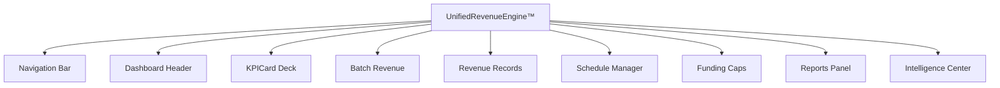

# UAMEX ERP™ — UnifiedRevenueEngine™ UI Components
## Complete Component Specifications — NEB-15

---

## 1. Component Architecture Overview

### 1.1 Component Hierarchy



### 1.2 Component File Structure

```
src/
├── components/
│   └── finance/
│       └── UnifiedRevenueEngine/
│           ├── index.tsx                      # Main container
│           ├── RevenueDashboard.tsx           # Dashboard view
│           ├── RevenueRecordsGrid.tsx         # Records list
│           ├── RevenueRecordForm.tsx          # Create/Edit form
│           ├── RevenueDetailPanel.tsx         # Detail view
│           ├── BatchRevenueManager.tsx        # Batch management
│           ├── BatchEntryBuilder.tsx         # Batch entry UI
│           ├── ScheduleManager.tsx           # Schedule UI
│           ├── FundingCapsManager.tsx         # Caps UI
│           ├── IntelligenceCenter.tsx         # AI insights
│           ├── ReportsCenter.tsx             # Reports
│           └── components/
│               ├── KPICard.tsx
│               ├── StatusBadge.tsx
│               ├── RevenueTypeBadge.tsx
│               ├── AmountDisplay.tsx
│               ├── CurrencySelector.tsx
│               ├── DateRangePicker.tsx
│               ├── ApprovalChain.tsx
│               ├── BatchEntryRow.tsx
│               ├── ScheduleTimeline.tsx
│               ├── ForecastChart.tsx
│               ├── BreakdownChart.tsx
│               ├── AnomalyAlert.tsx
│               └── ValidationStatus.tsx
```

---

## 2. Core Component Specifications

### 2.1 Main Container Component

```tsx
// ═══════════════════════════════════════════════════════════════════
// UnifiedRevenueEngine™ — Main Container
// src/components/finance/UnifiedRevenueEngine/index.tsx
// ═══════════════════════════════════════════════════════════════════

import React, { useState, useCallback, useMemo } from 'react';
import { 
  TrendingUp, FileText, Layers, Calendar, Shield, BarChart3, Brain,
  Settings, RefreshCw, Plus, Search, Filter, Download
} from 'lucide-react';

// ─── Types ────────────────────────────────────────────────────────
interface UnifiedRevenueEngineProps {
  lang: 'ar' | 'en';
  userId: string;
  userPermissions: string[];
  organizationId: string;
  fiscalYearId?: string;
  projects: Project[];
  accounts: Account[];
  onRevenueCreated?: (revenue: RevenueRecord) => void;
}

type ActiveTab = 
  | 'dashboard' 
  | 'records' 
  | 'batch' 
  | 'schedules' 
  | 'caps' 
  | 'reports' 
  | 'intelligence'
  | 'settings';

// ─── Main Component ────────────────────────────────────────────────
export const UnifiedRevenueEngine: React.FC<UnifiedRevenueEngineProps> = ({
  lang,
  userId,
  userPermissions,
  organizationId,
  fiscalYearId,
  projects,
  accounts,
  onRevenueCreated,
}) => {
  const isRtl = lang === 'ar';
  
  // State
  const [activeTab, setActiveTab] = useState<ActiveTab>('dashboard');
  const [isLoading, setIsLoading] = useState(false);
  const [globalError, setGlobalError] = useState<string | null>(null);
  
  // Filters
  const [filters, setFilters] = useState<RevenueFilters>({
    status: '',
    revenueType: '',
    projectId: '',
    fromDate: '',
    toDate: '',
    search: '',
  });
  
  // API Helper
  const api = useCallback(async (path: string, init?: RequestInit) => {
    const res = await fetch(path, { credentials: 'include', ...init });
    const json = await res.json().catch(() => ({}));
    if (!res.ok) {
      throw new Error(json?.error?.message || json?.error || `HTTP ${res.status}`);
    }
    return json?.data ?? json;
  }, []);
  
  // Permission Check Helper
  const hasPermission = useCallback((permission: string): boolean => {
    return userPermissions.includes(permission);
  }, [userPermissions]);
  
  // Tab Configuration
  const tabs = useMemo(() => [
    { 
      id: 'dashboard' as ActiveTab, 
      labelAr: 'لوحة التحكم', 
      labelEn: 'Dashboard', 
      icon: TrendingUp,
      permission: 'REVENUE_READ',
    },
    { 
      id: 'records' as ActiveTab, 
      labelAr: 'سجلات الإيرادات', 
      labelEn: 'Revenue Records', 
      icon: FileText,
      permission: 'REVENUE_READ',
    },
    { 
      id: 'batch' as ActiveTab, 
      labelAr: 'التوريد الجماعي', 
      labelEn: 'Batch Revenue', 
      icon: Layers,
      permission: 'BATCH_CREATE',
    },
    { 
      id: 'schedules' as ActiveTab, 
      labelAr: 'الجدولة', 
      labelEn: 'Schedules', 
      icon: Calendar,
      permission: 'SCHEDULE_VIEW',
    },
    { 
      id: 'caps' as ActiveTab, 
      labelAr: 'أسقف التمويل', 
      labelEn: 'Funding Caps', 
      icon: Shield,
      permission: 'FUNDING_CAP_VIEW',
    },
    { 
      id: 'reports' as ActiveTab, 
      labelAr: 'التقارير', 
      labelEn: 'Reports', 
      icon: BarChart3,
      permission: 'REPORT_REVENUE_BASIC',
    },
    { 
      id: 'intelligence' as ActiveTab, 
      labelAr: 'مركز الذكاء', 
      labelEn: 'Intelligence', 
      icon: Brain,
      permission: 'INTELLIGENCE_VIEW',
    },
    { 
      id: 'settings' as ActiveTab, 
      labelAr: 'الإعدادات', 
      labelEn: 'Settings', 
      icon: Settings,
      permission: 'REVENUE_ADMIN',
    },
  ], []);
  
  // Render Tab Content
  const renderTabContent = () => {
    switch (activeTab) {
      case 'dashboard':
        return (
          <RevenueDashboard
            lang={lang}
            organizationId={organizationId}
            api={api}
            projects={projects}
          />
        );
      case 'records':
        return (
          <RevenueRecordsGrid
            lang={lang}
            organizationId={organizationId}
            api={api}
            filters={filters}
            onFiltersChange={setFilters}
            projects={projects}
            accounts={accounts}
            userPermissions={userPermissions}
            onRevenueCreated={onRevenueCreated}
          />
        );
      case 'batch':
        return (
          <BatchRevenueManager
            lang={lang}
            organizationId={organizationId}
            api={api}
            accounts={accounts}
            projects={projects}
            userPermissions={userPermissions}
          />
        );
      case 'schedules':
        return (
          <ScheduleManager
            lang={lang}
            organizationId={organizationId}
            api={api}
          />
        );
      case 'caps':
        return (
          <FundingCapsManager
            lang={lang}
            organizationId={organizationId}
            api={api}
            userPermissions={userPermissions}
          />
        );
      case 'reports':
        return (
          <ReportsCenter
            lang={lang}
            organizationId={organizationId}
            api={api}
            userPermissions={userPermissions}
          />
        );
      case 'intelligence':
        return (
          <IntelligenceCenter
            lang={lang}
            organizationId={organizationId}
            api={api}
          />
        );
      case 'settings':
        return (
          <RevenueSettings
            lang={lang}
            organizationId={organizationId}
            api={api}
            userPermissions={userPermissions}
          />
        );
      default:
        return null;
    }
  };
  
  return (
    <div className="min-h-screen bg-slate-50 dark:bg-zinc-950">
      {/* Header */}
      <header className="sticky top-0 z-40 bg-white dark:bg-zinc-900 border-b border-slate-200 dark:border-zinc-800 shadow-sm">
        <div className="px-6 py-4">
          <div className="flex items-center justify-between">
            {/* Logo & Title */}
            <div className="flex items-center gap-4">
              <div className="w-12 h-12 rounded-2xl bg-gradient-to-br from-emerald-500 via-emerald-600 to-teal-700 flex items-center justify-center shadow-lg shadow-emerald-600/30">
                <TrendingUp className="w-6 h-6 text-white" />
              </div>
              <div>
                <h1 className="text-xl font-black text-slate-900 dark:text-zinc-100 flex items-center gap-2">
                  {isRtl ? 'محرك الإيرادات الموحد — NEB-15' : 'Unified Revenue Engine — NEB-15'}
                  <span className="px-2.5 py-1 bg-emerald-100 dark:bg-emerald-900/50 text-emerald-700 dark:text-emerald-300 text-[10px] font-mono font-black rounded-full">
                    {isRtl ? 'معتمد IPSAS' : 'IPSAS Ready'}
                  </span>
                </h1>
                <p className="text-sm text-slate-500 dark:text-zinc-400">
                  {isRtl 
                    ? 'إدارة شاملة ومتكاملة لكل أنواع الإيرادات — تبرعات، منح، استثمارات، أوقاف'
                    : 'Comprehensive revenue management — donations, grants, investments, endowments'}
                </p>
              </div>
            </div>
            
            {/* Actions */}
            <div className="flex items-center gap-3">
              <button
                onClick={() => window.location.reload()}
                className="px-4 py-2 rounded-xl bg-white dark:bg-zinc-800 border border-slate-200 dark:border-zinc-700 text-sm font-bold text-slate-600 dark:text-zinc-300 hover:bg-slate-50 dark:hover:bg-zinc-700 flex items-center gap-2 transition-colors cursor-pointer"
              >
                <RefreshCw className={`w-4 h-4 ${isLoading ? 'animate-spin' : ''}`} />
                {isRtl ? 'تحديث' : 'Refresh'}
              </button>
              
              <button
                onClick={() => setActiveTab('records')}
                className="px-5 py-2.5 rounded-xl bg-emerald-600 hover:bg-emerald-700 text-white text-sm font-black shadow-lg shadow-emerald-600/30 flex items-center gap-2 transition-colors cursor-pointer"
              >
                <Plus className="w-5 h-5" />
                {isRtl ? 'إيراد جديد' : 'New Revenue'}
              </button>
            </div>
          </div>
        </div>
        
        {/* Navigation Tabs */}
        <nav className="px-6 flex items-center gap-1 overflow-x-auto">
          {tabs
            .filter(tab => hasPermission(tab.permission))
            .map(tab => {
              const Icon = tab.icon;
              const isActive = activeTab === tab.id;
              return (
                <button
                  key={tab.id}
                  onClick={() => setActiveTab(tab.id)}
                  className={`
                    px-4 py-3 text-sm font-bold rounded-xl transition-all cursor-pointer
                    whitespace-nowrap flex items-center gap-2
                    ${isActive
                      ? 'bg-emerald-600 text-white shadow-md'
                      : 'text-slate-600 dark:text-zinc-400 hover:bg-slate-100 dark:hover:bg-zinc-800'
                    }
                  `}
                >
                  <Icon className={`w-4 h-4 ${isActive ? 'text-white' : ''}`} />
                  {isRtl ? tab.labelAr : tab.labelEn}
                </button>
              );
            })}
        </nav>
      </header>
      
      {/* Error Banner */}
      {globalError && (
        <div className="mx-6 mt-4 px-4 py-3 rounded-2xl bg-rose-50 dark:bg-rose-900/20 border border-rose-200 dark:border-rose-800 text-rose-700 dark:text-rose-300 text-sm font-bold flex items-center gap-2">
          <AlertCircle className="w-5 h-5 shrink-0" />
          {globalError}
          <button 
            onClick={() => setGlobalError(null)}
            className="mr-auto px-2 py-1 rounded-lg hover:bg-rose-100 dark:hover:bg-rose-900/40 cursor-pointer"
          >
            <XCircle className="w-4 h-4" />
          </button>
        </div>
      )}
      
      {/* Main Content */}
      <main className="p-6">
        {renderTabContent()}
      </main>
    </div>
  );
};

export default UnifiedRevenueEngine;
```

### 2.2 KPI Card Component

```tsx
// ═══════════════════════════════════════════════════════════════════
// KPICard — Reusable Metric Card
// src/components/finance/UnifiedRevenueEngine/components/KPICard.tsx
// ═══════════════════════════════════════════════════════════════════

import React from 'react';
import { LucideIcon, TrendingUp, TrendingDown, Minus } from 'lucide-react';

interface KPICardProps {
  label: string;
  value: string | number;
  icon: LucideIcon;
  color: 'emerald' | 'sky' | 'amber' | 'rose' | 'indigo' | 'violet' | 'slate';
  trend?: {
    value: string;
    direction: 'up' | 'down' | 'neutral';
  };
  alert?: boolean;
  alertMessage?: string;
  isRtl?: boolean;
}

const COLOR_MAP = {
  emerald: {
    bg: 'bg-emerald-50 dark:bg-emerald-950/30',
    border: 'border-emerald-200 dark:border-emerald-800/50',
    text: 'text-emerald-600 dark:text-emerald-400',
    iconBg: 'bg-emerald-100 dark:bg-emerald-900/50',
  },
  sky: {
    bg: 'bg-sky-50 dark:bg-sky-950/30',
    border: 'border-sky-200 dark:border-sky-800/50',
    text: 'text-sky-600 dark:text-sky-400',
    iconBg: 'bg-sky-100 dark:bg-sky-900/50',
  },
  amber: {
    bg: 'bg-amber-50 dark:bg-amber-950/30',
    border: 'border-amber-200 dark:border-amber-800/50',
    text: 'text-amber-600 dark:text-amber-400',
    iconBg: 'bg-amber-100 dark:bg-amber-900/50',
  },
  rose: {
    bg: 'bg-rose-50 dark:bg-rose-950/30',
    border: 'border-rose-200 dark:border-rose-800/50',
    text: 'text-rose-600 dark:text-rose-400',
    iconBg: 'bg-rose-100 dark:bg-rose-900/50',
  },
  indigo: {
    bg: 'bg-indigo-50 dark:bg-indigo-950/30',
    border: 'border-indigo-200 dark:border-indigo-800/50',
    text: 'text-indigo-600 dark:text-indigo-400',
    iconBg: 'bg-indigo-100 dark:bg-indigo-900/50',
  },
  violet: {
    bg: 'bg-violet-50 dark:bg-violet-950/30',
    border: 'border-violet-200 dark:border-violet-800/50',
    text: 'text-violet-600 dark:text-violet-400',
    iconBg: 'bg-violet-100 dark:bg-violet-900/50',
  },
  slate: {
    bg: 'bg-slate-50 dark:bg-zinc-800',
    border: 'border-slate-200 dark:border-zinc-700',
    text: 'text-slate-600 dark:text-zinc-400',
    iconBg: 'bg-slate-100 dark:bg-zinc-700',
  },
};

export const KPICard: React.FC<KPICardProps> = ({
  label,
  value,
  icon: Icon,
  color = 'emerald',
  trend,
  alert = false,
  alertMessage,
  isRtl = false,
}) => {
  const colors = COLOR_MAP[color];
  
  return (
    <div 
      className={`
        relative rounded-2xl border p-4 transition-all hover:shadow-md
        ${colors.bg} ${colors.border}
        ${alert ? 'ring-2 ring-rose-500/50' : ''}
      `}
    >
      {/* Alert Indicator */}
      {alert && (
        <div className="absolute -top-2 -right-2 w-6 h-6 rounded-full bg-rose-500 text-white flex items-center justify-center">
          <AlertCircle className="w-4 h-4" />
        </div>
      )}
      
      {/* Header */}
      <div className="flex items-start justify-between mb-3">
        <span className="text-[11px] font-bold text-slate-500 dark:text-zinc-400 uppercase tracking-wide">
          {label}
        </span>
        <div className={`p-2 rounded-xl ${colors.iconBg}`}>
          <Icon className={`w-4 h-4 ${colors.text}`} />
        </div>
      </div>
      
      {/* Value */}
      <div className="text-2xl font-black text-slate-900 dark:text-zinc-100 mb-2">
        {value}
      </div>
      
      {/* Trend */}
      {trend && (
        <div className="flex items-center gap-1.5">
          {trend.direction === 'up' && (
            <TrendingUp className="w-4 h-4 text-emerald-600" />
          )}
          {trend.direction === 'down' && (
            <TrendingDown className="w-4 h-4 text-rose-600" />
          )}
          {trend.direction === 'neutral' && (
            <Minus className="w-4 h-4 text-slate-500" />
          )}
          <span className={`
            text-xs font-bold
            ${trend.direction === 'up' ? 'text-emerald-600' : ''}
            ${trend.direction === 'down' ? 'text-rose-600' : ''}
            ${trend.direction === 'neutral' ? 'text-slate-500' : ''}
          `}>
            {trend.value}
          </span>
          <span className="text-xs text-slate-400 dark:text-zinc-500">
            {isRtl ? 'vs آخر فترة' : 'vs last period'}
          </span>
        </div>
      )}
      
      {/* Alert Message */}
      {alert && alertMessage && (
        <p className="mt-2 text-[10px] text-rose-600 dark:text-rose-400 font-bold">
          {alertMessage}
        </p>
      )}
    </div>
  );
};

export default KPICard;
```

### 2.3 Status Badge Component

```tsx
// ═══════════════════════════════════════════════════════════════════
// StatusBadge — Revenue Status Indicator
// src/components/finance/UnifiedRevenueEngine/components/StatusBadge.tsx
// ═══════════════════════════════════════════════════════════════════

import React from 'react';
import { CheckCircle2, Clock, XCircle, FileText, Banknote, AlertCircle, Ban, Sparkles } from 'lucide-react';
import type { RevenueStatus } from '../../../types/revenue.types';

interface StatusBadgeProps {
  status: RevenueStatus;
  lang?: 'ar' | 'en';
  size?: 'sm' | 'md' | 'lg';
}

const STATUS_CONFIG: Record<RevenueStatus, {
  labelAr: string;
  labelEn: string;
  cls: string;
  icon: React.ElementType;
}> = {
  DRAFT: {
    labelAr: 'مسودة',
    labelEn: 'Draft',
    cls: 'bg-zinc-100 text-zinc-700 dark:bg-zinc-800 dark:text-zinc-300 border-zinc-200 dark:border-zinc-700',
    icon: FileText,
  },
  PENDING_APPROVAL: {
    labelAr: 'بانتظار الاعتماد',
    labelEn: 'Pending Approval',
    cls: 'bg-amber-100 text-amber-700 dark:bg-amber-900/40 dark:text-amber-300 border-amber-200 dark:border-amber-800/50',
    icon: Clock,
  },
  APPROVED: {
    labelAr: 'معتمد',
    labelEn: 'Approved',
    cls: 'bg-blue-100 text-blue-700 dark:bg-blue-900/40 dark:text-blue-300 border-blue-200 dark:border-blue-800/50',
    icon: CheckCircle2,
  },
  POSTED: {
    labelAr: 'مرحّل',
    labelEn: 'Posted',
    cls: 'bg-indigo-100 text-indigo-700 dark:bg-indigo-900/40 dark:text-indigo-300 border-indigo-200 dark:border-indigo-800/50',
    icon: FileText,
  },
  PARTIALLY_COLLECTED: {
    labelAr: 'محصّل جزئياً',
    labelEn: 'Partially Collected',
    cls: 'bg-cyan-100 text-cyan-700 dark:bg-cyan-900/40 dark:text-cyan-300 border-cyan-200 dark:border-cyan-800/50',
    icon: Banknote,
  },
  COLLECTED: {
    labelAr: 'محصّل بالكامل',
    labelEn: 'Collected',
    cls: 'bg-emerald-100 text-emerald-700 dark:bg-emerald-900/40 dark:text-emerald-300 border-emerald-200 dark:border-emerald-800/50',
    icon: CheckCircle2,
  },
  REJECTED: {
    labelAr: 'مرفوض',
    labelEn: 'Rejected',
    cls: 'bg-rose-100 text-rose-700 dark:bg-rose-900/40 dark:text-rose-300 border-rose-200 dark:border-rose-800/50',
    icon: XCircle,
  },
  VOIDED: {
    labelAr: 'ملغى',
    labelEn: 'Voided',
    cls: 'bg-zinc-100 text-zinc-500 dark:bg-zinc-800 dark:text-zinc-500 border-zinc-200 dark:border-zinc-700',
    icon: Ban,
  },
  EXPIRED: {
    labelAr: 'منتهي',
    labelEn: 'Expired',
    cls: 'bg-orange-100 text-orange-700 dark:bg-orange-900/40 dark:text-orange-300 border-orange-200 dark:border-orange-800/50',
    icon: AlertCircle,
  },
  CONDITIONALLY_COMPLETED: {
    labelAr: 'مكتمل بشروط',
    labelEn: 'Conditionally Completed',
    cls: 'bg-teal-100 text-teal-700 dark:bg-teal-900/40 dark:text-teal-300 border-teal-200 dark:border-teal-800/50',
    icon: Sparkles,
  },
};

const SIZE_CLASSES = {
  sm: 'px-2 py-0.5 text-[9px] gap-1',
  md: 'px-2.5 py-1 text-[10px] gap-1.5',
  lg: 'px-3 py-1.5 text-xs gap-2',
};

export const StatusBadge: React.FC<StatusBadgeProps> = ({
  status,
  lang = 'ar',
  size = 'md',
}) => {
  const config = STATUS_CONFIG[status] || STATUS_CONFIG.DRAFT;
  const Icon = config.icon;
  const label = lang === 'ar' ? config.labelAr : config.labelEn;
  
  return (
    <span 
      className={`
        inline-flex items-center font-black rounded-full border
        ${config.cls} ${SIZE_CLASSES[size]}
      `}
    >
      <Icon className="w-3 h-3" />
      {label}
    </span>
  );
};

export default StatusBadge;
```

### 2.4 Revenue Type Badge Component

```tsx
// ═══════════════════════════════════════════════════════════════════
// RevenueTypeBadge — Revenue Type Indicator
// src/components/finance/UnifiedRevenueEngine/components/RevenueTypeBadge.tsx
// ═══════════════════════════════════════════════════════════════════

import React from 'react';
import { 
  Banknote, Gift, FileText, TrendingUp, Building2, Handshake, Users, 
  PieChart, FolderOpen, AlertCircle, SplitSquareHorizontal, Calendar 
} from 'lucide-react';
import type { RevenueTypeCode } from '../../../types/revenue.types';

interface RevenueTypeBadgeProps {
  type: RevenueTypeCode;
  lang?: 'ar' | 'en';
  size?: 'sm' | 'md' | 'lg';
  showIcon?: boolean;
}

const TYPE_CONFIG: Record<RevenueTypeCode, {
  labelAr: string;
  labelEn: string;
  cls: string;
  icon: React.ElementType;
}> = {
  CASH_DON: {
    labelAr: 'تبرعات نقدية',
    labelEn: 'Cash Donation',
    cls: 'bg-emerald-100 text-emerald-700 dark:bg-emerald-900/40 dark:text-emerald-300 border-emerald-200 dark:border-emerald-800/50',
    icon: Banknote,
  },
  INKIND_DON: {
    labelAr: 'تبرعات عينية',
    labelEn: 'In-Kind Donation',
    cls: 'bg-purple-100 text-purple-700 dark:bg-purple-900/40 dark:text-purple-300 border-purple-200 dark:border-purple-800/50',
    icon: Gift,
  },
  GRANT: {
    labelAr: 'منح',
    labelEn: 'Grant',
    cls: 'bg-blue-100 text-blue-700 dark:bg-blue-900/40 dark:text-blue-300 border-blue-200 dark:border-blue-800/50',
    icon: FileText,
  },
  INVEST_REV: {
    labelAr: 'إيرادات استثمارية',
    labelEn: 'Investment Revenue',
    cls: 'bg-amber-100 text-amber-700 dark:bg-amber-900/40 dark:text-amber-300 border-amber-200 dark:border-amber-800/50',
    icon: TrendingUp,
  },
  ENDOW_REV: {
    labelAr: 'إيرادات وقفية',
    labelEn: 'Endowment Revenue',
    cls: 'bg-teal-100 text-teal-700 dark:bg-teal-900/40 dark:text-teal-300 border-teal-200 dark:border-teal-800/50',
    icon: Building2,
  },
  SERVICE_FEE: {
    labelAr: 'رسوم خدمات',
    labelEn: 'Service Fee',
    cls: 'bg-cyan-100 text-cyan-700 dark:bg-cyan-900/40 dark:text-cyan-300 border-cyan-200 dark:border-cyan-800/50',
    icon: Handshake,
  },
  MEMBERSHIP: {
    labelAr: 'اشتراكات عضوية',
    labelEn: 'Membership Fee',
    cls: 'bg-indigo-100 text-indigo-700 dark:bg-indigo-900/40 dark:text-indigo-300 border-indigo-200 dark:border-indigo-800/50',
    icon: Users,
  },
  PROFIT_SHARE: {
    labelAr: 'حصص أرباح',
    labelEn: 'Profit Share',
    cls: 'bg-orange-100 text-orange-700 dark:bg-orange-900/40 dark:text-orange-300 border-orange-200 dark:border-orange-800/50',
    icon: PieChart,
  },
  PROGRAM_REV: {
    labelAr: 'إيرادات برامج',
    labelEn: 'Program Revenue',
    cls: 'bg-sky-100 text-sky-700 dark:bg-sky-900/40 dark:text-sky-300 border-sky-200 dark:border-sky-800/50',
    icon: FolderOpen,
  },
  COND_FUND: {
    labelAr: 'تمويل مشروط',
    labelEn: 'Conditional Funding',
    cls: 'bg-rose-100 text-rose-700 dark:bg-rose-900/40 dark:text-rose-300 border-rose-200 dark:border-rose-800/50',
    icon: AlertCircle,
  },
  PARTIAL_FUND: {
    labelAr: 'تمويل جزئي',
    labelEn: 'Partial Funding',
    cls: 'bg-pink-100 text-pink-700 dark:bg-pink-900/40 dark:text-pink-300 border-pink-200 dark:border-pink-800/50',
    icon: SplitSquareHorizontal,
  },
  MULTIYEAR_FUND: {
    labelAr: 'تمويل متعدد السنوات',
    labelEn: 'Multi-Year Funding',
    cls: 'bg-violet-100 text-violet-700 dark:bg-violet-900/40 dark:text-violet-300 border-violet-200 dark:border-violet-800/50',
    icon: Calendar,
  },
};

const SIZE_CLASSES = {
  sm: 'px-2 py-0.5 text-[9px] gap-1',
  md: 'px-2.5 py-1 text-[10px] gap-1.5',
  lg: 'px-3 py-1.5 text-xs gap-2',
};

export const RevenueTypeBadge: React.FC<RevenueTypeBadgeProps> = ({
  type,
  lang = 'ar',
  size = 'md',
  showIcon = true,
}) => {
  const config = TYPE_CONFIG[type] || TYPE_CONFIG.CASH_DON;
  const Icon = config.icon;
  const label = lang === 'ar' ? config.labelAr : config.labelEn;
  
  return (
    <span 
      className={`
        inline-flex items-center font-black rounded-lg border
        ${config.cls} ${SIZE_CLASSES[size]}
      `}
    >
      {showIcon && <Icon className="w-3 h-3" />}
      {label}
    </span>
  );
};

export default RevenueTypeBadge;
```

### 2.5 Amount Display Component

```tsx
// ═══════════════════════════════════════════════════════════════════
// AmountDisplay — Formatted Currency Display
// src/components/finance/UnifiedRevenueEngine/components/AmountDisplay.tsx
// ═══════════════════════════════════════════════════════════════════

import React, { useMemo } from 'react';

interface AmountDisplayProps {
  amount: number;
  currencyCode: string;
  locale?: string;
  showCurrency?: boolean;
  showSign?: boolean;
  size?: 'sm' | 'md' | 'lg' | 'xl';
  colorize?: boolean;
  highlightZero?: boolean;
}

const SIZE_CLASSES = {
  sm: 'text-xs',
  md: 'text-sm',
  lg: 'text-lg',
  xl: 'text-2xl',
};

const CURRENCY_SYMBOLS: Record<string, string> = {
  YER: 'ر.ي',
  USD: '$',
  SAR: 'ر.س',
  EUR: '€',
  AED: 'د.إ',
  GBP: '£',
  JPY: '¥',
};

export const AmountDisplay: React.FC<AmountDisplayProps> = ({
  amount,
  currencyCode,
  locale = 'en-US',
  showCurrency = true,
  showSign = false,
  size = 'md',
  colorize = false,
  highlightZero = false,
}) => {
  const formatted = useMemo(() => {
    const formattedNumber = Number(amount || 0).toLocaleString(locale, {
      minimumFractionDigits: 2,
      maximumFractionDigits: 2,
    });
    
    const sign = showSign && amount > 0 ? '+' : '';
    const symbol = showCurrency ? `${CURRENCY_SYMBOLS[currencyCode] || currencyCode} ` : '';
    
    return `${sign}${symbol}${formattedNumber}`;
  }, [amount, currencyCode, locale, showCurrency, showSign]);
  
  const colorClass = useMemo(() => {
    if (!colorize) return 'text-slate-900 dark:text-zinc-100';
    
    if (amount === 0 && highlightZero) return 'text-slate-400 dark:text-zinc-500';
    if (amount > 0) return 'text-emerald-600 dark:text-emerald-400';
    if (amount < 0) return 'text-rose-600 dark:text-rose-400';
    return 'text-slate-900 dark:text-zinc-100';
  }, [amount, colorize, highlightZero]);
  
  return (
    <span className={`font-black font-mono ${SIZE_CLASSES[size]} ${colorClass}`}>
      {formatted}
    </span>
  );
};

export default AmountDisplay;
```

### 2.6 Batch Entry Row Component

```tsx
// ═══════════════════════════════════════════════════════════════════
// BatchEntryRow — Single Line in Batch Entry Builder
// src/components/finance/UnifiedRevenueEngine/components/BatchEntryRow.tsx
// ═══════════════════════════════════════════════════════════════════

import React from 'react';
import { Trash2, AlertCircle, CheckCircle2 } from 'lucide-react';
import type { RevenueBatchEntry, Account, Project } from '../../../types';

interface BatchEntryRowProps {
  entry: RevenueBatchEntry;
  accounts: Account[];
  projects: Project[];
  index: number;
  onChange: (entry: RevenueBatchEntry) => void;
  onDelete: () => void;
  isRtl?: boolean;
  errors?: string[];
}

export const BatchEntryRow: React.FC<BatchEntryRowProps> = ({
  entry,
  accounts,
  projects,
  index,
  onChange,
  onDelete,
  isRtl = false,
  errors = [],
}) => {
  const hasError = errors.length > 0;
  const isBalanced = entry.debit === 0 || entry.credit === 0;
  
  return (
    <tr className={`
      border-b border-slate-100 dark:border-zinc-800
      ${hasError ? 'bg-rose-50 dark:bg-rose-950/20' : 'hover:bg-slate-50/50 dark:hover:bg-zinc-800/30'}
    `}>
      {/* Sequence */}
      <td className="px-3 py-2.5 text-center">
        <span className="w-6 h-6 rounded-full bg-slate-200 dark:bg-zinc-700 text-slate-600 dark:text-zinc-300 text-xs font-black flex items-center justify-center">
          {index + 1}
        </span>
      </td>
      
      {/* Account */}
      <td className="px-3 py-2.5 min-w-[200px]">
        <select
          value={entry.accountId || ''}
          onChange={(e) => {
            const acc = accounts.find(a => a.id === e.target.value);
            onChange({
              ...entry,
              accountId: e.target.value,
              accountCode: acc?.account_code || '',
              accountNameAr: acc?.name_ar || '',
            });
          }}
          className="w-full px-3 py-2 rounded-lg border border-slate-200 dark:border-zinc-700 bg-white dark:bg-zinc-900 text-sm focus:ring-2 focus:ring-emerald-500 outline-none"
        >
          <option value="">{isRtl ? '— اختر الحساب —' : '— Select Account —'}</option>
          {accounts.map(acc => (
            <option key={acc.id} value={acc.id}>
              {acc.account_code} — {acc.name_ar}
            </option>
          ))}
        </select>
      </td>
      
      {/* Project */}
      <td className="px-3 py-2.5 min-w-[150px]">
        <select
          value={entry.projectId || ''}
          onChange={(e) => {
            const proj = projects.find(p => p.id === e.target.value);
            onChange({
              ...entry,
              projectId: e.target.value,
              projectCode: proj?.project_code || '',
              projectNameAr: proj?.name_ar || '',
            });
          }}
          className="w-full px-3 py-2 rounded-lg border border-slate-200 dark:border-zinc-700 bg-white dark:bg-zinc-900 text-sm focus:ring-2 focus:ring-emerald-500 outline-none"
        >
          <option value="">{isRtl ? '— بدون مشروع —' : '— No Project —'}</option>
          {projects.map(proj => (
            <option key={proj.id} value={proj.id}>
              {proj.project_code} — {proj.name_ar}
            </option>
          ))}
        </select>
      </td>
      
      {/* Debit */}
      <td className="px-3 py-2.5 w-32">
        <input
          type="number"
          min="0"
          step="0.01"
          value={entry.debit || ''}
          onChange={(e) => {
            const value = parseFloat(e.target.value) || 0;
            onChange({
              ...entry,
              debit: value,
              credit: value > 0 ? 0 : entry.credit, // Clear credit if debit entered
            });
          }}
          className="w-full px-3 py-2 rounded-lg border border-slate-200 dark:border-zinc-700 bg-white dark:bg-zinc-900 text-sm text-end font-mono focus:ring-2 focus:ring-emerald-500 outline-none"
          placeholder="0.00"
        />
      </td>
      
      {/* Credit */}
      <td className="px-3 py-2.5 w-32">
        <input
          type="number"
          min="0"
          step="0.01"
          value={entry.credit || ''}
          onChange={(e) => {
            const value = parseFloat(e.target.value) || 0;
            onChange({
              ...entry,
              credit: value,
              debit: value > 0 ? 0 : entry.debit, // Clear debit if credit entered
            });
          }}
          className="w-full px-3 py-2 rounded-lg border border-slate-200 dark:border-zinc-700 bg-white dark:bg-zinc-900 text-sm text-end font-mono focus:ring-2 focus:ring-emerald-500 outline-none"
          placeholder="0.00"
        />
      </td>
      
      {/* Description */}
      <td className="px-3 py-2.5 min-w-[150px]">
        <input
          type="text"
          value={entry.lineDescription || ''}
          onChange={(e) => onChange({ ...entry, lineDescription: e.target.value })}
          className="w-full px-3 py-2 rounded-lg border border-slate-200 dark:border-zinc-700 bg-white dark:bg-zinc-900 text-sm focus:ring-2 focus:ring-emerald-500 outline-none"
          placeholder={isRtl ? 'وصف القيد...' : 'Description...'}
        />
      </td>
      
      {/* Validation */}
      <td className="px-3 py-2.5 w-10 text-center">
        {hasError ? (
          <div className="group relative">
            <AlertCircle className="w-5 h-5 text-rose-500" />
            <div className="absolute bottom-full left-1/2 -translate-x-1/2 mb-2 px-3 py-2 bg-rose-900 text-white text-xs rounded-lg opacity-0 group-hover:opacity-100 transition-opacity whitespace-nowrap z-10">
              {errors.map((err, i) => <div key={i}>{err}</div>)}
            </div>
          </div>
        ) : isBalanced && (entry.debit > 0 || entry.credit > 0) ? (
          <CheckCircle2 className="w-5 h-5 text-emerald-500" />
        ) : null}
      </td>
      
      {/* Delete */}
      <td className="px-3 py-2.5 w-10">
        <button
          onClick={onDelete}
          className="p-2 rounded-lg text-slate-400 hover:text-rose-600 hover:bg-rose-50 dark:hover:bg-rose-900/30 transition-colors cursor-pointer"
        >
          <Trash2 className="w-4 h-4" />
        </button>
      </td>
    </tr>
  );
};

export default BatchEntryRow;
```

### 2.7 Approval Chain Visualization Component

```tsx
// ═══════════════════════════════════════════════════════════════════
// ApprovalChain — Visual Approval Workflow
// src/components/finance/UnifiedRevenueEngine/components/ApprovalChain.tsx
// ═══════════════════════════════════════════════════════════════════

import React from 'react';
import { CheckCircle2, Clock, XCircle, User, ChevronRight } from 'lucide-react';
import type { ApprovalLogEntry } from '../../../types';

interface ApprovalChainProps {
  approvals: ApprovalLogEntry[];
  requiredLevels: number;
  currentLevel: number;
  isRtl?: boolean;
}

export const ApprovalChain: React.FC<ApprovalChainProps> = ({
  approvals,
  requiredLevels,
  currentLevel,
  isRtl = false,
}) => {
  const approvalsByLevel = Array.from({ length: requiredLevels }, (_, i) => i + 1)
    .map(level => ({
      level,
      approval: approvals.find(a => a.level === level),
    }));
  
  return (
    <div className="space-y-3">
      <h4 className="text-xs font-black text-slate-700 dark:text-zinc-200">
        {isRtl ? 'سير الاعتماد' : 'Approval Chain'}
      </h4>
      
      <div className="flex items-center gap-2 overflow-x-auto pb-2">
        {approvalsByLevel.map(({ level, approval }, idx) => {
          const isCompleted = approval?.action === 'APPROVE';
          const isRejected = approval?.action === 'REJECT';
          const isPending = !approval;
          const isCurrent = level === currentLevel;
          
          let Icon = Clock;
          let bgClass = 'bg-slate-100 dark:bg-zinc-800';
          let borderClass = 'border-slate-200 dark:border-zinc-700';
          let textClass = 'text-slate-500 dark:text-zinc-400';
          
          if (isCompleted) {
            Icon = CheckCircle2;
            bgClass = 'bg-emerald-50 dark:bg-emerald-950/50';
            borderClass = 'border-emerald-300 dark:border-emerald-700';
            textClass = 'text-emerald-600 dark:text-emerald-400';
          } else if (isRejected) {
            Icon = XCircle;
            bgClass = 'bg-rose-50 dark:bg-rose-950/50';
            borderClass = 'border-rose-300 dark:border-rose-700';
            textClass = 'text-rose-600 dark:text-rose-400';
          } else if (isCurrent) {
            Icon = Clock;
            bgClass = 'bg-amber-50 dark:bg-amber-950/50';
            borderClass = 'border-amber-300 dark:border-amber-700';
            textClass = 'text-amber-600 dark:text-amber-400';
          }
          
          return (
            <React.Fragment key={level}>
              <div 
                className={`
                  flex-shrink-0 flex flex-col items-center p-3 rounded-xl border-2
                  ${bgClass} ${borderClass} ${isCurrent ? 'ring-2 ring-amber-400/50' : ''}
                `}
                style={{ minWidth: '120px' }}
              >
                <div className={`p-2 rounded-full ${bgClass} mb-2`}>
                  <Icon className={`w-5 h-5 ${textClass}`} />
                </div>
                
                <span className="text-[10px] font-black text-slate-500 dark:text-zinc-400 mb-1">
                  {isRtl ? 'المستوى' : 'Level'} {level}
                </span>
                
                {approval ? (
                  <div className="text-center">
                    <span className="text-xs font-bold text-slate-700 dark:text-zinc-200 flex items-center gap-1">
                      <User className="w-3 h-3" />
                      {approval.approverName}
                    </span>
                    {approval.respondedAt && (
                      <span className="text-[9px] text-slate-400 dark:text-zinc-500">
                        {new Date(approval.respondedAt).toLocaleDateString(isRtl ? 'ar-YE' : 'en-US')}
                      </span>
                    )}
                  </div>
                ) : (
                  <span className="text-xs text-slate-400 dark:text-zinc-500">
                    {isCurrent ? (isRtl ? 'قيد الانتظار' : 'Pending') : (isRtl ? 'لم يأتِ' : 'Not reached')}
                  </span>
                )}
              </div>
              
              {idx < approvalsByLevel.length - 1 && (
                <ChevronRight className={`w-4 h-4 text-slate-300 dark:text-zinc-600 flex-shrink-0 ${isRtl ? 'rotate-180' : ''}`} />
              )}
            </React.Fragment>
          );
        })}
      </div>
    </div>
  );
};

export default ApprovalChain;
```

### 2.8 Forecast Chart Component

```tsx
// ═══════════════════════════════════════════════════════════════════
// ForecastChart — Revenue Prediction Visualization
// src/components/finance/UnifiedRevenueEngine/components/ForecastChart.tsx
// ═══════════════════════════════════════════════════════════════════

import React, { useMemo } from 'react';
import { TrendingUp, TrendingDown, AlertTriangle } from 'lucide-react';
import type { RevenueForecast, ForecastPeriod } from '../../../types';

interface ForecastChartProps {
  forecast: RevenueForecast;
  isRtl?: boolean;
}

export const ForecastChart: React.FC<ForecastChartProps> = ({
  forecast,
  isRtl = false,
}) => {
  const { maxValue, periods } = useMemo(() => {
    const allValues = forecast.periods.flatMap(p => [p.predicted, p.confidenceLow, p.confidenceHigh]);
    const max = Math.max(...allValues);
    return { maxValue: max * 1.1, periods: forecast.periods };
  }, [forecast]);
  
  const confidenceColors = {
    HIGH: { bg: 'bg-emerald-500/10', line: 'bg-emerald-500', fill: 'fill-emerald-500' },
    MEDIUM: { bg: 'bg-amber-500/10', line: 'bg-amber-500', fill: 'fill-amber-500' },
    LOW: { bg: 'bg-rose-500/10', line: 'bg-rose-500', fill: 'fill-rose-500' },
  };
  
  const colors = confidenceColors[forecast.confidence];
  
  const fmt = (v: number) => (v / 1000000).toFixed(1) + 'M';
  
  return (
    <div className="bg-white dark:bg-zinc-900 rounded-2xl border border-slate-200 dark:border-zinc-800 p-5">
      {/* Header */}
      <div className="flex items-center justify-between mb-4">
        <div>
          <h4 className="text-sm font-black text-slate-800 dark:text-zinc-100 flex items-center gap-2">
            <TrendingUp className="w-5 h-5 text-emerald-600" />
            {isRtl ? 'توقع الإيرادات' : 'Revenue Forecast'}
          </h4>
          <p className="text-xs text-slate-500 dark:text-zinc-400 mt-1">
            {isRtl 
              ? `المنهجية: ${forecast.methodology} | ثقة: ${forecast.confidence}`
              : `Methodology: ${forecast.methodology} | Confidence: ${forecast.confidence}`}
          </p>
        </div>
        
        <div className={`
          px-3 py-1.5 rounded-full text-xs font-black
          ${colors.bg} ${colors.line} bg-opacity-20
        `}>
          {isRtl ? 'ثقة' : 'Confidence'}: {forecast.confidence}
        </div>
      </div>
      
      {/* Chart */}
      <div className="relative h-48">
        {/* Y-Axis Labels */}
        <div className="absolute left-0 top-0 bottom-0 flex flex-col justify-between text-[10px] text-slate-400 font-mono pr-2">
          <span>{fmt(maxValue)}</span>
          <span>{fmt(maxValue * 0.75)}</span>
          <span>{fmt(maxValue * 0.5)}</span>
          <span>{fmt(maxValue * 0.25)}</span>
          <span>0</span>
        </div>
        
        {/* Chart Area */}
        <div className="absolute left-10 right-0 top-0 bottom-4 flex items-end">
          {/* Grid Lines */}
          <div className="absolute inset-0 flex flex-col justify-between">
            {[0, 1, 2, 3, 4].map(i => (
              <div key={i} className="border-b border-slate-100 dark:border-zinc-800 w-full" />
            ))}
          </div>
          
          {/* Confidence Band */}
          <svg className="absolute inset-0 w-full h-full" preserveAspectRatio="none">
            <defs>
              <linearGradient id="confidenceGradient" x1="0" y1="0" x2="0" y2="1">
                <stop offset="0%" stopColor={colors.line.replace('bg-', '')} stopOpacity="0.2" />
                <stop offset="100%" stopColor={colors.line.replace('bg-', '')} stopOpacity="0.05" />
              </linearGradient>
            </defs>
            
            {/* Confidence Band Path */}
            <path
              d={`
                M ${periods.map((p, i) => `${(i / (periods.length - 1)) * 100} ${100 - (p.confidenceHigh / maxValue) * 100}`).join(' L ')}
                L ${periods.map((p, i) => `${(i / (periods.length - 1)) * 100} ${100 - (p.confidenceLow / maxValue) * 100}`).join(' L ')}
                Z
              `}
              fill="url(#confidenceGradient)"
            />
            
            {/* Predicted Line */}
            <polyline
              points={periods.map((p, i) => `${(i / (periods.length - 1)) * 100},${100 - (p.predicted / maxValue) * 100}`).join(' ')}
              fill="none"
              stroke={colors.line.replace('bg-', 'text-')}
              strokeWidth="2"
              className={colors.line}
            />
            
            {/* Actual Points (if past data) */}
            {periods.filter(p => p.isActual).map((p, i) => (
              <circle
                key={`actual-${i}`}
                cx={`${(i / (periods.length - 1)) * 100}%`}
                cy={`${100 - ((p.actualAmount || 0) / maxValue) * 100}%`}
                r="4"
                className="fill-emerald-600"
              />
            ))}
          </svg>
          
          {/* X-Axis Labels */}
          <div className="absolute bottom-0 left-0 right-0 flex justify-between text-[10px] text-slate-400 font-mono">
            {periods.map((p, i) => (
              <span 
                key={i} 
                className={`text-center ${p.isActual ? 'text-emerald-600 font-bold' : ''}`}
              >
                {p.period.split('-')[1]}/{p.period.split('-')[0].slice(2)}
              </span>
            ))}
          </div>
        </div>
      </div>
      
      {/* Legend */}
      <div className="flex items-center gap-4 mt-4 pt-4 border-t border-slate-100 dark:border-zinc-800">
        <div className="flex items-center gap-2">
          <div className={`w-4 h-0.5 ${colors.line}`} />
          <span className="text-[10px] text-slate-500">
            {isRtl ? 'المتوقع' : 'Predicted'}
          </span>
        </div>
        <div className="flex items-center gap-2">
          <div className={`w-4 h-3 ${colors.bg} rounded`} />
          <span className="text-[10px] text-slate-500">
            {isRtl ? 'نطاق الثقة' : 'Confidence Range'}
          </span>
        </div>
        <div className="flex items-center gap-2">
          <div className="w-3 h-3 rounded-full bg-emerald-600" />
          <span className="text-[10px] text-slate-500">
            {isRtl ? 'فعلي' : 'Actual'}
          </span>
        </div>
      </div>
    </div>
  );
};

export default ForecastChart;
```

---

## 3. Dashboard Layouts

### 3.1 Revenue Dashboard Layout

```tsx
// ═══════════════════════════════════════════════════════════════════
// RevenueDashboard — Main Dashboard View
// src/components/finance/UnifiedRevenueEngine/RevenueDashboard.tsx
// ═══════════════════════════════════════════════════════════════════

import React, { useState, useEffect, useCallback } from 'react';
import { TrendingUp, Banknote, Clock, CheckCircle2, ShieldAlert, FileText, 
         Sparkles, RefreshCw, TrendingDown, AlertTriangle } from 'lucide-react';
import { KPICard } from './components/KPICard';
import { ForecastChart } from './components/ForecastChart';
import { BreakdownChart } from './components/BreakdownChart';
import { AnomalyAlert } from './components/AnomalyAlert';

interface RevenueDashboardProps {
  lang: 'ar' | 'en';
  organizationId: string;
  api: (path: string, init?: RequestInit) => Promise<any>;
  projects: any[];
}

export const RevenueDashboard: React.FC<RevenueDashboardProps> = ({
  lang,
  organizationId,
  api,
  projects,
}) => {
  const isRtl = lang === 'ar';
  const [loading, setLoading] = useState(true);
  const [snapshot, setSnapshot] = useState<any>(null);
  const [error, setError] = useState<string | null>(null);
  
  const loadSnapshot = useCallback(async () => {
    setLoading(true);
    setError(null);
    try {
      const data = await api(`/api/v2/revenue/intelligence/snapshot?period=CURRENT_YEAR`);
      setSnapshot(data);
    } catch (e: any) {
      setError(e.message);
    } finally {
      setLoading(false);
    }
  }, [api]);
  
  useEffect(() => {
    loadSnapshot();
  }, [loadSnapshot]);
  
  if (loading) {
    return (
      <div className="flex items-center justify-center h-64">
        <div className="animate-spin w-8 h-8 border-4 border-emerald-500 border-t-transparent rounded-full" />
      </div>
    );
  }
  
  if (error) {
    return (
      <div className="p-6 bg-rose-50 dark:bg-rose-950/30 rounded-2xl border border-rose-200 dark:border-rose-800">
        <p className="text-rose-700 dark:text-rose-300 font-bold">{error}</p>
        <button onClick={loadSnapshot} className="mt-2 text-rose-600 underline">
          {isRtl ? 'إعادة المحاولة' : 'Retry'}
        </button>
      </div>
    );
  }
  
  const { kpis, forecast, breakdowns, anomalies, insights } = snapshot || {};
  
  return (
    <div className="space-y-6">
      {/* KPI Cards Grid */}
      <div className="grid grid-cols-2 md:grid-cols-3 xl:grid-cols-6 gap-4">
        <KPICard
          label={isRtl ? 'إجمالي الإيرادات' : 'Total Recognized'}
          value={Number(kpis?.totalRecognized || 0).toLocaleString()}
          icon={TrendingUp}
          color="emerald"
          trend={{ value: '+12.5%', direction: 'up' }}
          isRtl={isRtl}
        />
        <KPICard
          label={isRtl ? 'المحصّل' : 'Collected'}
          value={Number(kpis?.totalCollected || 0).toLocaleString()}
          icon={Banknote}
          color="sky"
          trend={{ value: '+8.2%', direction: 'up' }}
          isRtl={isRtl}
        />
        <KPICard
          label={isRtl ? 'المستحق' : 'Outstanding'}
          value={Number(kpis?.totalOutstanding || 0).toLocaleString()}
          icon={Clock}
          color="amber"
          trend={{ value: '-3.1%', direction: 'down' }}
          isRtl={isRtl}
        />
        <KPICard
          label={isRtl ? 'معدل التحصيل' : 'Collection Rate'}
          value={`${kpis?.collectionRatePct || 0}%`}
          icon={CheckCircle2}
          color={kpis?.collectionRatePct > 80 ? 'emerald' : 'amber'}
          isRtl={isRtl}
        />
        <KPICard
          label={isRtl ? 'تركّز أكبر 10' : 'Top-10 Concentration'}
          value={`${kpis?.concentrationTop10Pct || 0}%`}
          icon={ShieldAlert}
          color={kpis?.concentrationTop10Pct > 50 ? 'rose' : 'slate'}
          alert={kpis?.concentrationTop10Pct > 50}
          alertMessage={isRtl ? 'خطر: تركّز عالي!' : 'Risk: High concentration!'}
          isRtl={isRtl}
        />
        <KPICard
          label={isRtl ? 'عدد المستندات' : 'Record Count'}
          value={kpis?.recordCount || 0}
          icon={FileText}
          color="indigo"
          isRtl={isRtl}
        />
      </div>
      
      {/* Charts Row */}
      <div className="grid lg:grid-cols-2 gap-6">
        {/* Forecast Chart */}
        {forecast && (
          <ForecastChart forecast={forecast} isRtl={isRtl} />
        )}
        
        {/* Breakdown by Type */}
        <BreakdownChart 
          data={breakdowns?.byType || []} 
          title={isRtl ? 'توزيع الإيرادات حسب النوع' : 'Revenue by Type'}
          isRtl={isRtl}
        />
      </div>
      
      {/* AI Insights & Anomalies */}
      <div className="grid lg:grid-cols-2 gap-6">
        {/* AI Insights */}
        <div className="bg-gradient-to-br from-emerald-600 to-teal-700 rounded-2xl p-5 text-white">
          <div className="flex items-center gap-2 mb-4">
            <Sparkles className="w-5 h-5" />
            <h3 className="text-sm font-black">{isRtl ? 'رؤى الذكاء المالي' : 'Financial Intelligence Insights'}</h3>
          </div>
          
          {insights?.length > 0 ? (
            <div className="space-y-3">
              {insights.slice(0, 5).map((insight: any, idx: number) => (
                <div 
                  key={idx}
                  className={`
                    p-3 rounded-xl backdrop-blur-sm
                    ${insight.priority === 'HIGH' ? 'bg-white/20' : 'bg-white/10'}
                  `}
                >
                  <div className="flex items-start gap-2">
                    {insight.category === 'OPPORTUNITY' && <TrendingUp className="w-4 h-4 text-emerald-300 shrink-0 mt-0.5" />}
                    {insight.category === 'RISK' && <AlertTriangle className="w-4 h-4 text-amber-300 shrink-0 mt-0.5" />}
                    <div>
                      <h4 className="text-xs font-black">{isRtl ? insight.titleAr : insight.titleEn}</h4>
                      <p className="text-[10px] opacity-80 mt-1">
                        {isRtl ? insight.descriptionAr : insight.descriptionEn}
                      </p>
                    </div>
                  </div>
                </div>
              ))}
            </div>
          ) : (
            <p className="text-sm opacity-80">{isRtl ? 'لا توجد رؤى حالياً' : 'No insights available'}</p>
          )}
        </div>
        
        {/* Anomaly Alerts */}
        <div className="bg-white dark:bg-zinc-900 rounded-2xl border border-slate-200 dark:border-zinc-800 p-5">
          <div className="flex items-center justify-between mb-4">
            <h3 className="text-sm font-black text-slate-800 dark:text-zinc-100">
              {isRtl ? 'تنبيهات anomalies' : 'Anomaly Alerts'}
            </h3>
            <span className="px-2 py-1 bg-rose-100 dark:bg-rose-900/50 text-rose-700 dark:text-rose-300 text-[10px] font-black rounded-full">
              {anomalies?.filter((a: any) => a.status === 'NEW').length || 0} {isRtl ? 'جديد' : 'New'}
            </span>
          </div>
          
          <div className="space-y-3">
            {anomalies?.filter((a: any) => a.status === 'NEW').slice(0, 4).map((anomaly: any) => (
              <AnomalyAlert key={anomaly.id} anomaly={anomaly} isRtl={isRtl} />
            ))}
          </div>
        </div>
      </div>
    </div>
  );
};

export default RevenueDashboard;
```

---

## 4. State Management Patterns

### 4.1 Revenue Records State

```tsx
// ─── Revenue Records State Management Hook ────────────────────────
import { useState, useCallback, useMemo } from 'react';
import type { RevenueRecord, RevenueFilters, PaginationParams } from '../../../types';

interface UseRevenueRecordsOptions {
  api: (path: string, init?: RequestInit) => Promise<any>;
  organizationId: string;
  initialFilters?: RevenueFilters;
}

interface UseRevenueRecordsReturn {
  // State
  records: RevenueRecord[];
  totalRecords: number;
  currentPage: number;
  pageSize: number;
  isLoading: boolean;
  error: string | null;
  filters: RevenueFilters;
  
  // Actions
  setFilters: (filters: RevenueFilters) => void;
  loadRecords: (page?: number) => Promise<void>;
  refreshRecords: () => Promise<void>;
  createRecord: (data: CreateRevenueDTO) => Promise<RevenueRecord>;
  updateRecord: (id: string, data: UpdateRevenueDTO) => Promise<RevenueRecord>;
  deleteRecord: (id: string) => Promise<void>;
  
  // Workflow Actions
  submitForApproval: (id: string) => Promise<void>;
  approveRecord: (id: string, comments?: string) => Promise<void>;
  rejectRecord: (id: string, reason: string) => Promise<void>;
  postToLedger: (id: string) => Promise<void>;
  collectRevenue: (id: string, amount: number, method: string) => Promise<void>;
  voidRecord: (id: string, reason: string) => Promise<void>;
}

export function useRevenueRecords({
  api,
  organizationId,
  initialFilters = {},
}: UseRevenueRecordsOptions): UseRevenueRecordsReturn {
  // State
  const [records, setRecords] = useState<RevenueRecord[]>([]);
  const [totalRecords, setTotalRecords] = useState(0);
  const [currentPage, setCurrentPage] = useState(1);
  const [pageSize] = useState(50);
  const [isLoading, setIsLoading] = useState(false);
  const [error, setError] = useState<string | null>(null);
  const [filters, setFiltersState] = useState<RevenueFilters>(initialFilters);
  
  // Build query string from filters
  const buildQueryString = useCallback((page: number, currentFilters: RevenueFilters) => {
    const params = new URLSearchParams();
    params.set('page', String(page));
    params.set('pageSize', String(pageSize));
    
    Object.entries(currentFilters).forEach(([key, value]) => {
      if (value !== '' && value !== undefined && value !== null) {
        params.set(key, String(value));
      }
    });
    
    return params.toString();
  }, [pageSize]);
  
  // Load records
  const loadRecords = useCallback(async (page = 1) => {
    setIsLoading(true);
    setError(null);
    
    try {
      const queryString = buildQueryString(page, filters);
      const response = await api(`/api/v2/revenue/records?${queryString}`);
      
      setRecords(response.data || []);
      setTotalRecords(response.pagination?.total || 0);
      setCurrentPage(page);
    } catch (e: any) {
      setError(e.message);
    } finally {
      setIsLoading(false);
    }
  }, [api, filters, buildQueryString]);
  
  // Refresh
  const refreshRecords = useCallback(async () => {
    await loadRecords(currentPage);
  }, [loadRecords, currentPage]);
  
  // Set filters
  const setFilters = useCallback((newFilters: RevenueFilters) => {
    setFiltersState(newFilters);
    loadRecords(1);
  }, [loadRecords]);
  
  // Create record
  const createRecord = useCallback(async (data: CreateRevenueDTO): Promise<RevenueRecord> => {
    const response = await api('/api/v2/revenue/records', {
      method: 'POST',
      headers: { 'Content-Type': 'application/json' },
      body: JSON.stringify(data),
    });
    await refreshRecords();
    return response;
  }, [api, refreshRecords]);
  
  // Workflow action helper
  const workflowAction = useCallback(async (
    id: string, 
    action: string, 
    body?: any
  ) => {
    await api(`/api/v2/revenue/records/${id}/${action}`, {
      method: 'POST',
      headers: { 'Content-Type': 'application/json' },
      body: JSON.stringify(body || {}),
    });
    await refreshRecords();
  }, [api, refreshRecords]);
  
  // Individual workflow methods
  const submitForApproval = useCallback((id: string) => 
    workflowAction(id, 'submit'), [workflowAction]);
  
  const approveRecord = useCallback((id: string, comments?: string) => 
    workflowAction(id, 'approve', { comments }), [workflowAction]);
  
  const rejectRecord = useCallback((id: string, reason: string) => 
    workflowAction(id, 'reject', { reason }), [workflowAction]);
  
  const postToLedger = useCallback((id: string) => 
    workflowAction(id, 'post'), [workflowAction]);
  
  const collectRevenue = useCallback((id: string, amount: number, method: string) => 
    workflowAction(id, 'collect', { amount, paymentMethod: method }), [workflowAction]);
  
  const voidRecord = useCallback((id: string, reason: string) => 
    workflowAction(id, 'void', { reason }), [workflowAction]);
  
  // Initial load
  useMemo(() => {
    loadRecords(1);
  }, []); // eslint-disable-line react-hooks/exhaustive-deps
  
  return {
    records,
    totalRecords,
    currentPage,
    pageSize,
    isLoading,
    error,
    filters,
    setFilters,
    loadRecords,
    refreshRecords,
    createRecord,
    updateRecord: async () => {}, // Placeholder
    deleteRecord: async () => {}, // Placeholder
    submitForApproval,
    approveRecord,
    rejectRecord,
    postToLedger,
    collectRevenue,
    voidRecord,
  };
}
```

---

## 5. Accessibility Guidelines

### 5.1 ARIA Labels

```tsx
// All interactive elements must have proper ARIA labels
<button
  aria-label={isRtl ? 'إضافة إيراد جديد' : 'Add new revenue'}
  aria-describedby="revenue-create-hint"
>
  <Plus className="w-5 h-5" />
</button>

// Status badges should announce state changes
<span 
  role="status" 
  aria-live="polite"
  aria-label={`${statusLabel} status`}
>
  <StatusBadge status={status} />
</span>

// Data tables should have proper headers
<table aria-label={isRtl ? 'جدول الإيرادات' : 'Revenue records table'}>
  <thead>
    <tr>
      <th scope="col" aria-sort={sortColumn === 'amount' ? sortDirection : 'none'}>
        {isRtl ? 'المبلغ' : 'Amount'}
      </th>
    </tr>
  </thead>
</table>
```

### 5.2 Keyboard Navigation

```tsx
// Tab navigation for forms
<form onKeyDown={(e) => {
  if (e.key === 'Tab' && !e.shiftKey) {
    // Move to next field
  }
  if (e.key === 'Tab' && e.shiftKey) {
    // Move to previous field
  }
  if (e.key === 'Enter' && e.ctrlKey) {
    // Submit form
  }
}}>

// Arrow keys for dropdown navigation
<select 
  onKeyDown={(e) => {
    if (e.key === 'ArrowDown') {
      e.preventDefault();
      // Navigate to next option
    }
    if (e.key === 'ArrowUp') {
      e.preventDefault();
      // Navigate to previous option
    }
  }}
>
```

### 5.3 Color Contrast

```tsx
// Ensure minimum contrast ratio of 4.5:1 for text
// Use Tailwind's dark: prefix for dark mode support
<div className="text-slate-900 dark:text-zinc-100">
  {/* Primary content */}
</div>

// Interactive elements need 3:1 contrast
<button className="bg-emerald-600 hover:bg-emerald-700 text-white">
  {/* Action button */}
</button>

// Status indicators should not rely on color alone
<span className="text-emerald-700">
  <CheckCircle2 className="w-4 h-4" /> {isRtl ? 'نجح' : 'Success'}
</span>
```

---

## 6. Responsive Design Breakpoints

```tsx
// Mobile First Approach
// sm: 640px - Large phones
// md: 768px - Tablets
// lg: 1024px - Laptops
// xl: 1280px - Desktops
// 2xl: 1536px - Large screens

// Example responsive grid
<div className="
  grid grid-cols-1        // Mobile
  sm:grid-cols-2          // Large phones
  md:grid-cols-3          // Tablets
  lg:grid-cols-4          // Laptops
  xl:grid-cols-6          // Desktops
  gap-4
">
  {/* KPI Cards */}
</div>

// Responsive text
<h1 className="
  text-lg               // Mobile
  sm:text-xl            // Large phones
  md:text-2xl           // Tablets
  lg:text-3xl           // Laptops
  font-black
">
  {title}
</h1>

// Responsive padding
<div className="
  p-4                  // Mobile
  md:p-6               // Tablets
  lg:p-8               // Desktops
">
```

---

## 7. Dark Mode Implementation

```tsx
// All components must support dark mode using Tailwind's dark: prefix
<div className="
  bg-white              // Light mode background
  dark:bg-zinc-900     // Dark mode background
  border-slate-200      // Light mode border
  dark:border-zinc-800 // Dark mode border
  text-slate-900        // Light mode text
  dark:text-zinc-100    // Dark mode text
">
  {/* Content */}
</div>

// Dark mode specific gradients
<div className="
  bg-gradient-to-br from-emerald-500 to-teal-700
  dark:from-emerald-600 dark:to-teal-800
">
  {/* Gradient adapts to mode */}
</div>

// Opacity adjustments for dark mode
<div className="
  bg-emerald-100        // Light mode
  dark:bg-emerald-950/30 // Dark mode with reduced opacity
">
  {/* Subtle dark mode support */}
</div>
```

---

## 8. Animation Guidelines

```tsx
// Use Tailwind's animation utilities
<div className="
  animate-in             // Entrance animation
  fade-in               // Fade in effect
  duration-300          // 300ms duration
  delay-100             // 100ms delay
">
  {/* Animated content */}
</div>

// Loading states
<div className="animate-pulse">
  {/* Skeleton loading */}
</div>

// Spinning loaders
<div className="animate-spin w-6 h-6 border-4 border-emerald-500 border-t-transparent rounded-full">
</div>

// Hover transitions
<button className="
  transition-all        // Animate all properties
  duration-200          // 200ms transition
  ease-in-out           // Smooth easing
  hover:scale-105       // Scale on hover
  hover:shadow-lg        // Shadow on hover
">
  {/* Button */}
</button>
```

---

**Document Version**: 1.0.0  
**Total Components**: 20+  
**Last Updated**: 2026-08-30
