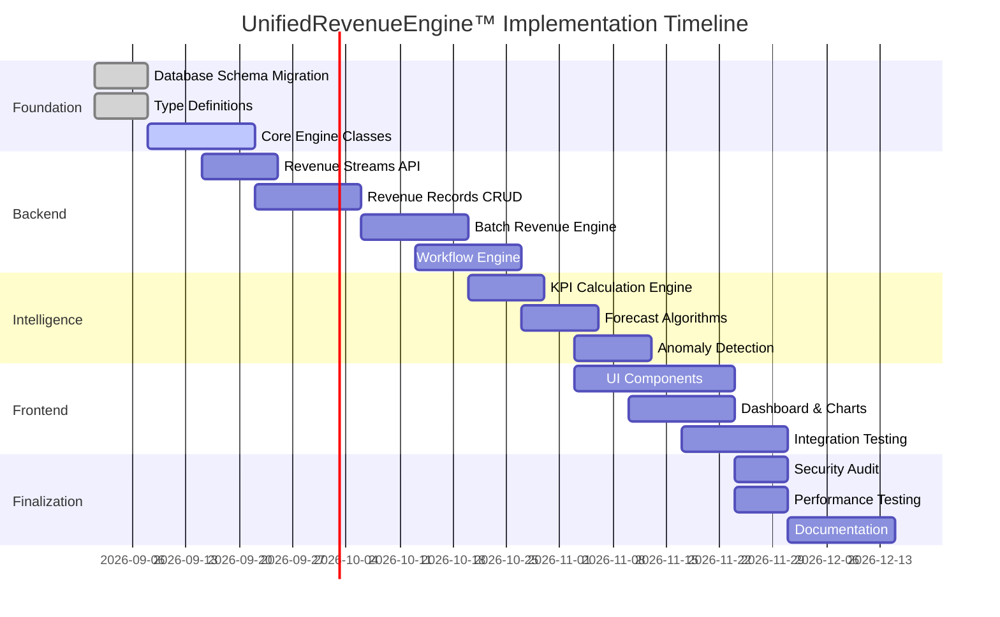

# UAMEX ERP™ — UnifiedRevenueEngine™ Implementation Plan
## Execution Roadmap — NEB-15

---

## Executive Summary

This document outlines the comprehensive implementation plan for the **UnifiedRevenueEngine™** module, covering all 12 revenue types, batch processing, enterprise workflows, and financial intelligence capabilities.

**Total Duration**: 12 weeks  
**Team Composition**: 4-6 developers  
**Documentation Created**: 
- `UNIFIED_REVENUE_ENGINE_ARCHITECTURE.md`
- `UNIFIED_REVENUE_ENGINE_DATA_MODELS.md`
- `UNIFIED_REVENUE_ENGINE_API.md`
- `UNIFIED_REVENUE_ENGINE_UI.md`

---

## 1. Project Phases Overview



---

## 2. Phase 1: Foundation (Week 1-2)

### 2.1 Database Schema Migration

**Objective**: Create all required tables and indexes in PostgreSQL

**Files to Create**:
```
src/server/database/migrations/
├── 001_revenue_streams.sql
├── 002_revenue_records.sql
├── 003_revenue_batches.sql
├── 004_revenue_schedules.sql
├── 005_funding_caps.sql
├── 006_revenue_workflows.sql
├── 007_revenue_intelligence.sql
└── 008_revenue_sync_status.sql
```

**Tasks**:

| # | Task | Owner | Effort | Dependencies |
|---|------|-------|--------|--------------|
| 1.1 | Create `revenue_streams` table | Backend Dev 1 | 4h | None |
| 1.2 | Create `revenue_records` table | Backend Dev 1 | 8h | None |
| 1.3 | Create `revenue_batches` & `revenue_batch_entries` tables | Backend Dev 1 | 6h | 1.2 |
| 1.4 | Create `revenue_schedules` & `revenue_milestones` tables | Backend Dev 2 | 6h | 1.2 |
| 1.5 | Create `funding_caps` & `funding_cap_reservations` tables | Backend Dev 2 | 4h | None |
| 1.6 | Create `revenue_approval_workflows` & `revenue_approval_log` tables | Backend Dev 1 | 4h | None |
| 1.7 | Create `revenue_intelligence_cache` table | Backend Dev 2 | 4h | None |
| 1.8 | Create all indexes | Backend Dev 1 | 4h | 1.1-1.7 |
| 1.9 | Create seed data for default revenue streams | Backend Dev 1 | 4h | 1.1 |
| 1.10 | Migration test & rollback scripts | Backend Dev 1 | 8h | 1.1-1.9 |

**Deliverables**:
- ✅ 8 new tables created
- ✅ 15+ indexes created
- ✅ Seed data for 12 revenue types
- ✅ Rollback scripts tested

### 2.2 TypeScript Type Definitions

**Objective**: Create comprehensive type definitions

**Files to Create**:
```
src/types/revenue/
├── index.ts                    # Main exports
├── revenue.types.ts            # Core revenue types
├── batch.types.ts              # Batch processing types
├── schedule.types.ts           # Schedule types
├── workflow.types.ts           # Workflow types
├── intelligence.types.ts       # Analytics types
├── permission.types.ts         # RBAC types
└── api.types.ts                # API request/response types
```

**Tasks**:

| # | Task | Owner | Effort |
|---|------|-------|--------|
| 2.1 | Create all enums and type aliases | Frontend Dev 1 | 4h |
| 2.2 | Create `RevenueRecord` interface | Frontend Dev 1 | 4h |
| 2.3 | Create `RevenueBatch` & `RevenueBatchEntry` interfaces | Frontend Dev 1 | 4h |
| 2.4 | Create schedule & milestone interfaces | Frontend Dev 1 | 4h |
| 2.5 | Create funding cap interfaces | Frontend Dev 2 | 4h |
| 2.6 | Create workflow interfaces | Frontend Dev 2 | 4h |
| 2.7 | Create intelligence & analytics interfaces | Frontend Dev 2 | 4h |
| 2.8 | Create API request/response types | Frontend Dev 1 | 6h |
| 2.9 | Create Zod validation schemas | Frontend Dev 1 | 6h |
| 2.10 | Type export & documentation | Frontend Dev 1 | 2h |

**Deliverables**:
- ✅ 50+ TypeScript interfaces
- ✅ 15+ enum/type aliases
- ✅ Zod validation schemas
- ✅ Complete type documentation

### 2.3 Core Engine Classes

**Objective**: Create the business logic layer

**Files to Create**:
```
src/server/engines/
├── revenue.engine.ts           # Main revenue engine
├── revenue-batch.engine.ts     # Batch processing
├── revenue-schedule.engine.ts   # Schedule management
├── revenue-workflow.engine.ts  # Approval workflows
├── revenue-cap.engine.ts       # Funding cap validation
├── revenue-recognition.engine.ts # Revenue recognition
└── revenue-intelligence.engine.ts # Analytics & forecasting
```

**Tasks**:

| # | Task | Owner | Effort | Dependencies |
|---|------|-------|--------|--------------|
| 3.1 | Create `RevenueEngine` class with state machine | Backend Dev 1 | 16h | 1.2, 2.2 |
| 3.2 | Implement `RevenueBatchEngine` with validation | Backend Dev 2 | 16h | 1.3, 2.3 |
| 3.3 | Implement `RevenueScheduleEngine` | Backend Dev 2 | 12h | 1.4, 2.4 |
| 3.4 | Implement `RevenueWorkflowEngine` | Backend Dev 1 | 16h | 1.6, 2.6 |
| 3.5 | Implement `FundingCapEngine` | Backend Dev 2 | 12h | 1.5, 2.5 |
| 3.6 | Implement `RevenueRecognitionEngine` | Backend Dev 1 | 16h | 2.7 |
| 3.7 | Implement `RevenueIntelligenceEngine` | Backend Dev 2 | 20h | 2.7 |
| 3.8 | Unit tests for all engines | QA Dev | 24h | 3.1-3.7 |

**Deliverables**:
- ✅ 7 engine classes
- ✅ Full state machine implementation
- ✅ 50+ unit tests
- ✅ 80% code coverage

---

## 3. Phase 2: Backend API Development (Week 3-5)

### 3.1 Revenue Streams API

**Objective**: CRUD operations for revenue stream classification

**Tasks**:

| # | Task | Effort | Dependencies |
|---|------|--------|--------------|
| 4.1 | Implement `GET /streams` endpoint | 8h | 2.1, 3.1 |
| 4.2 | Implement `GET /streams/:id` endpoint | 4h | 4.1 |
| 4.3 | Implement `POST /streams` endpoint | 8h | 4.1 |
| 4.4 | Implement `PUT /streams/:id` endpoint | 6h | 4.3 |
| 4.5 | Implement `DELETE /streams/:id` endpoint | 4h | 4.4 |
| 4.6 | Add stream usage statistics endpoint | 4h | 4.2 |
| 4.7 | Write API integration tests | 8h | 4.1-4.6 |

### 3.2 Revenue Records CRUD

**Objective**: Complete CRUD for revenue records

**Tasks**:

| # | Task | Effort | Dependencies |
|---|------|--------|--------------|
| 5.1 | Implement `GET /records` with filters & pagination | 16h | 3.1 |
| 5.2 | Implement `GET /records/:id` with full details | 8h | 5.1 |
| 5.3 | Implement `POST /records` with validation | 16h | 5.1 |
| 5.4 | Implement `PUT /records/:id` | 8h | 5.3 |
| 5.5 | Implement `DELETE /records/:id` (void) | 6h | 5.4 |
| 5.6 | Write CRUD integration tests | 16h | 5.1-5.5 |

### 3.3 Workflow Actions API

**Objective**: Status transitions and approval workflows

**Tasks**:

| # | Task | Effort | Dependencies |
|---|------|--------|--------------|
| 6.1 | Implement `POST /records/:id/submit` | 8h | 5.3, 3.4 |
| 6.2 | Implement `POST /records/:id/approve` | 8h | 6.1 |
| 6.3 | Implement `POST /records/:id/reject` | 6h | 6.2 |
| 6.4 | Implement `POST /records/:id/post` | 16h | 6.3 |
| 6.5 | Implement `POST /records/:id/collect` | 12h | 6.4 |
| 6.6 | Implement `POST /records/:id/recognize` | 8h | 6.5 |
| 6.7 | Implement `POST /records/:id/void` | 6h | 6.6 |
| 6.8 | Write workflow integration tests | 16h | 6.1-6.7 |

### 3.4 Batch Revenue API

**Objective**: Multi-entry batch processing

**Tasks**:

| # | Task | Effort | Dependencies |
|---|------|--------|--------------|
| 7.1 | Implement `GET /batches` | 8h | 3.2 |
| 7.2 | Implement `GET /batches/:id` | 6h | 7.1 |
| 7.3 | Implement `POST /batches` with validation | 16h | 7.1 |
| 7.4 | Implement `POST /batches/:id/validate` | 8h | 7.3 |
| 7.5 | Implement batch approval workflow | 12h | 7.4 |
| 7.6 | Implement `POST /batches/:id/post` | 16h | 7.5 |
| 7.7 | Write batch integration tests | 16h | 7.1-7.6 |

### 3.5 Schedule & Cap APIs

**Objective**: Schedule management and funding caps

**Tasks**:

| # | Task | Effort | Dependencies |
|---|------|--------|--------------|
| 8.1 | Implement schedule CRUD endpoints | 12h | 3.3 |
| 8.2 | Implement `POST /schedules/:id/verify-condition` | 8h | 8.1 |
| 8.3 | Implement `POST /schedules/:id/process-payment` | 8h | 8.2 |
| 8.4 | Implement funding caps CRUD | 12h | 3.5 |
| 8.5 | Implement `POST /caps/:id/check` | 6h | 8.4 |
| 8.6 | Implement cap utilization report | 8h | 8.5 |
| 8.7 | Write schedule & cap tests | 12h | 8.1-8.6 |

---

## 4. Phase 3: Intelligence & Analytics (Week 6-7)

### 4.1 KPI Calculation Engine

**Objective**: Real-time KPI computation

**Tasks**:

| # | Task | Effort | Dependencies |
|---|------|--------|--------------|
| 9.1 | Implement KPI calculation service | 16h | 2.7 |
| 9.2 | Implement breakdown aggregations | 12h | 9.1 |
| 9.3 | Implement real-time KPI cache | 8h | 9.1 |
| 9.4 | Implement `GET /intelligence/kpis` | 4h | 9.3 |
| 9.5 | Implement `GET /intelligence/breakdowns` | 4h | 9.2 |

### 4.2 Forecast Algorithms

**Objective**: Revenue prediction engine

**Tasks**:

| # | Task | Effort | Dependencies |
|---|------|--------|--------------|
| 10.1 | Implement linear regression forecast | 16h | 9.1 |
| 10.2 | Implement seasonal decomposition | 16h | 10.1 |
| 10.3 | Implement confidence intervals | 8h | 10.2 |
| 10.4 | Implement forecast caching | 6h | 10.3 |
| 10.5 | Implement `GET /intelligence/forecast` | 4h | 10.4 |

### 4.3 Anomaly Detection

**Objective**: AI-powered anomaly detection

**Tasks**:

| # | Task | Effort | Dependencies |
|---|------|--------|--------------|
| 11.1 | Implement concentration detection | 12h | 9.1 |
| 11.2 | Implement pattern deviation detection | 16h | 11.1 |
| 11.3 | Implement delayed collection detection | 8h | 11.2 |
| 11.4 | Implement anomaly severity scoring | 8h | 11.3 |
| 11.5 | Implement `GET /intelligence/anomalies` | 6h | 11.4 |
| 11.6 | Implement anomaly acknowledgment | 4h | 11.5 |

### 4.4 Intelligence Snapshot

**Objective**: Combined intelligence dashboard data

**Tasks**:

| # | Task | Effort | Dependencies |
|---|------|--------|--------------|
| 12.1 | Implement snapshot aggregation | 12h | 9.5, 10.5, 11.6 |
| 12.2 | Implement AI insights generation | 16h | 12.1 |
| 12.3 | Implement snapshot caching | 6h | 12.2 |
| 12.4 | Implement `GET /intelligence/snapshot` | 4h | 12.3 |

---

## 5. Phase 4: Frontend Development (Week 6-9)

### 5.1 Core UI Components

**Objective**: Reusable component library

**Tasks**:

| # | Task | Effort | Dependencies |
|---|------|--------|--------------|
| 13.1 | Implement KPICard component | 6h | 2.1-2.10 |
| 13.2 | Implement StatusBadge component | 4h | 13.1 |
| 13.3 | Implement RevenueTypeBadge component | 4h | 13.1 |
| 13.4 | Implement AmountDisplay component | 6h | 13.1 |
| 13.5 | Implement CurrencySelector component | 4h | 13.4 |
| 13.6 | Implement DateRangePicker component | 8h | 13.1 |
| 13.7 | Implement BatchEntryRow component | 12h | 13.1-13.6 |
| 13.8 | Implement ApprovalChain component | 10h | 13.1 |
| 13.9 | Implement ValidationStatus component | 4h | 13.1 |
| 13.10 | Implement ScheduleTimeline component | 10h | 13.1 |

### 5.2 Dashboard Components

**Objective**: Main dashboard UI

**Tasks**:

| # | Task | Effort | Dependencies |
|---|------|--------|--------------|
| 14.1 | Implement ForecastChart component | 16h | 13.1 |
| 14.2 | Implement BreakdownChart (pie/bar) | 12h | 14.1 |
| 14.3 | Implement AnomalyAlert component | 8h | 14.1 |
| 14.4 | Implement RevenueDashboard view | 16h | 14.1-14.3 |
| 14.5 | Integrate KPI deck | 8h | 14.4 |
| 14.6 | Add animations & transitions | 8h | 14.5 |

### 5.3 Records Grid & Forms

**Objective**: Revenue records management

**Tasks**:

| # | Task | Effort | Dependencies |
|---|------|--------|--------------|
| 15.1 | Implement RevenueRecordsGrid with filters | 16h | 13.1-13.10 |
| 15.2 | Implement RevenueRecordForm | 20h | 15.1 |
| 15.3 | Implement RevenueDetailPanel | 16h | 15.1 |
| 15.4 | Implement CollectionWizard | 16h | 15.3 |
| 15.5 | Implement WorkflowActionButtons | 8h | 15.1 |
| 15.6 | Implement inline editing | 12h | 15.1 |

### 5.4 Batch Revenue Manager

**Objective**: Batch processing UI

**Tasks**:

| # | Task | Effort | Dependencies |
|---|------|--------|--------------|
| 16.1 | Implement BatchEntryBuilder | 20h | 13.7 |
| 16.2 | Implement BatchBalanceValidator | 8h | 16.1 |
| 16.3 | Implement BatchApprovalChain | 8h | 13.8, 16.1 |
| 16.4 | Implement BatchRevenueManager view | 16h | 16.1-16.3 |
| 16.5 | Implement batch import (CSV/Excel) | 16h | 16.4 |

### 5.5 Reports & Settings

**Objective**: Reports center and configuration

**Tasks**:

| # | Task | Effort | Dependencies |
|---|------|--------|--------------|
| 17.1 | Implement ReportsCenter view | 16h | 14.1-14.6 |
| 17.2 | Implement ReportFilters | 8h | 17.1 |
| 17.3 | Implement Export functionality | 12h | 17.2 |
| 17.4 | Implement RevenueSettings view | 12h | 13.1 |
| 17.5 | Implement WorkflowConfiguration | 16h | 17.4 |

---

## 6. Phase 5: Integration & Testing (Week 9-11)

### 6.1 System Integration

**Objective**: Connect with existing modules

**Tasks**:

| # | Task | Effort | Dependencies |
|---|------|--------|--------------|
| 18.1 | Integrate with Ledger Engine | 16h | 3.6 |
| 18.2 | Integrate with Budget Engine | 12h | 18.1 |
| 18.3 | Integrate with Grant Management | 12h | 18.1 |
| 18.4 | Integrate with Endowment System | 8h | 18.1 |
| 18.5 | Integrate with Project Management | 8h | 18.1 |
| 18.6 | Implement sync status tracking | 12h | 18.1-18.5 |

### 6.2 Security & Permissions

**Objective**: RBAC implementation

**Tasks**:

| # | Task | Effort | Dependencies |
|---|------|--------|--------------|
| 19.1 | Implement permission middleware | 12h | 2.8 |
| 19.2 | Implement role-based access | 16h | 19.1 |
| 19.3 | Implement activity-level permissions | 12h | 19.2 |
| 19.4 | Implement audit logging | 12h | 19.3 |
| 19.5 | Security penetration testing | 16h | 19.4 |

### 6.3 Performance Optimization

**Objective**: Ensure optimal performance

**Tasks**:

| # | Task | Effort | Dependencies |
|---|------|--------|--------------|
| 20.1 | Query optimization (indexes, caching) | 16h | 1.8 |
| 20.2 | Implement Redis caching | 12h | 20.1 |
| 20.3 | Lazy loading for large datasets | 12h | 20.1 |
| 20.4 | API response optimization | 8h | 20.3 |
| 20.5 | Load testing | 16h | 20.4 |

### 6.4 Integration Testing

**Objective**: End-to-end testing

**Tasks**:

| # | Task | Effort | Dependencies |
|---|------|--------|--------------|
| 21.1 | API integration tests | 24h | 4.1-8.7 |
| 21.2 | UI component tests (Vitest) | 24h | 13.1-17.5 |
| 21.3 | E2E tests (Playwright) | 24h | 21.1, 21.2 |
| 21.4 | Regression testing | 16h | 21.3 |
| 21.5 | User acceptance testing (UAT) | 24h | 21.4 |

---

## 7. Phase 6: Documentation & Deployment (Week 11-12)

### 7.1 Documentation

**Objective**: Complete technical documentation

**Tasks**:

| # | Task | Effort | Dependencies |
|---|------|--------|--------------|
| 22.1 | API documentation (OpenAPI/Swagger) | 16h | 4.1-8.7 |
| 22.2 | Component documentation (Storybook) | 16h | 13.1-17.5 |
| 22.3 | User manual | 24h | 22.1 |
| 22.4 | Developer guide | 16h | 22.1 |
| 22.5 | Deployment guide | 8h | 22.4 |

### 7.2 Deployment

**Objective**: Production-ready deployment

**Tasks**:

| # | Task | Effort | Dependencies |
|---|------|--------|--------------|
| 23.1 | CI/CD pipeline setup | 16h | 22.1 |
| 23.2 | Staging environment deployment | 8h | 23.1 |
| 23.3 | Production deployment | 8h | 23.2 |
| 23.4 | Monitoring setup | 12h | 23.3 |
| 23.5 | Backup & recovery verification | 8h | 23.4 |

---

## 8. Resource Allocation

### 8.1 Team Composition

| Role | Count | Responsibilities |
|------|-------|------------------|
| Backend Developer 1 | 1 | Database, API, Workflow Engines |
| Backend Developer 2 | 1 | Batch Processing, Intelligence Engine |
| Frontend Developer 1 | 1 | UI Components, Dashboard |
| Frontend Developer 2 | 1 | Forms, Reports, Settings |
| QA Engineer | 1 | Testing, UAT |
| Tech Lead | 1 | Architecture, Code Review, Integration |

### 8.2 Time Allocation

| Phase | Duration | Total Hours | Team Members |
|-------|----------|-------------|--------------|
| Phase 1: Foundation | 2 weeks | 320h | All (parallel) |
| Phase 2: Backend API | 3 weeks | 480h | Backend 1, 2 |
| Phase 3: Intelligence | 2 weeks | 320h | Backend 2 |
| Phase 4: Frontend | 4 weeks | 640h | Frontend 1, 2 |
| Phase 5: Integration | 3 weeks | 480h | All |
| Phase 6: Docs & Deploy | 2 weeks | 320h | All |
| **Total** | **12 weeks** | **2,560h** | |

---

## 9. Risk Assessment

| Risk | Probability | Impact | Mitigation |
|------|-------------|--------|------------|
| Complex deferred revenue logic | High | Medium | Early spike, detailed specs |
| Performance with large datasets | Medium | High | Indexing, caching from start |
| Integration delays with Ledger | Medium | Medium | Mock implementations first |
| Scope creep | Medium | High | Strict change control process |
| Resource availability | Low | High | Cross-training, documentation |

---

## 10. Success Criteria

### 10.1 Functional Requirements
- [ ] All 12 revenue types supported
- [ ] Complete CRUD for revenue records
- [ ] Batch processing with validation
- [ ] Multi-level approval workflows
- [ ] Funding cap enforcement
- [ ] Schedule management with milestones
- [ ] Real-time KPI dashboard
- [ ] AI-powered forecasting
- [ ] Anomaly detection

### 10.2 Technical Requirements
- [ ] 80%+ code coverage
- [ ] API response time < 200ms
- [ ] Page load time < 2s
- [ ] Mobile responsive
- [ ] RTL/LTR support
- [ ] Dark/Light mode
- [ ] WCAG 2.1 AA compliance

### 10.3 Integration Requirements
- [ ] Ledger posting
- [ ] Budget tracking
- [ ] Grant linkage
- [ ] Endowment integration
- [ ] Project linkage

---

## 11. Deliverables Checklist

### Documentation
- [x] Architecture Document
- [x] Data Models (TypeScript)
- [x] API Specifications
- [x] UI Components Guide
- [ ] API Documentation (Swagger)
- [ ] User Manual
- [ ] Developer Guide

### Code
- [ ] Database migrations (8 files)
- [ ] Type definitions (8 files)
- [ ] Engine classes (7 files)
- [ ] API routes (~60 endpoints)
- [ ] UI components (20+)
- [ ] Integration tests
- [ ] E2E tests

### Infrastructure
- [ ] CI/CD pipeline
- [ ] Staging environment
- [ ] Production deployment
- [ ] Monitoring setup
- [ ] Backup verification

---

## 12. Appendix

### A. File Naming Conventions

```
# Backend
engines/           -> *.engine.ts
routes/            -> *.routes.ts
middleware/        -> *.middleware.ts
validators/        -> *.validator.ts

# Frontend
components/        -> *.tsx
hooks/             -> use*.ts
contexts/          -> *Context.tsx
utils/             -> *.utils.ts
types/             -> *.types.ts
```

### B. Code Style Guide

- Use TypeScript strict mode
- Follow ESLint + Prettier configuration
- Use functional components with hooks
- Implement error boundaries
- Use React.memo for optimization
- Follow atomic design principles

### C. Git Workflow

```
feature/NEB-15-revenue-streams     -> Revenue Streams
feature/NEB-15-revenue-records     -> Records CRUD
feature/NEB-15-batch-processing    -> Batch Engine
feature/NEB-15-workflows           -> Approval Workflows
feature/NEB-15-intelligence        -> AI & Analytics
feature/NEB-15-ui-components       -> Frontend Components
feature/NEB-15-integration         -> System Integration
release/NEB-15-v1.0.0             -> Final Release
```

---

**Document Version**: 1.0.0  
**Created**: 2026-08-30  
**Author**: UAMEX ERP™ Architecture Team  
**Organization**: Rohamaab Charity Foundation — UAMEX ERP™ NexoraOS

---

## Quick Start Commands

```bash
# Run migrations
npm run migrate:revenue

# Start development server
npm run dev:revenue

# Run tests
npm run test:revenue

# Build for production
npm run build:revenue

# Deploy
npm run deploy:revenue:staging
npm run deploy:revenue:production
```

---

**Ready for Implementation** ✅
